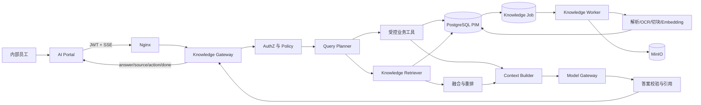
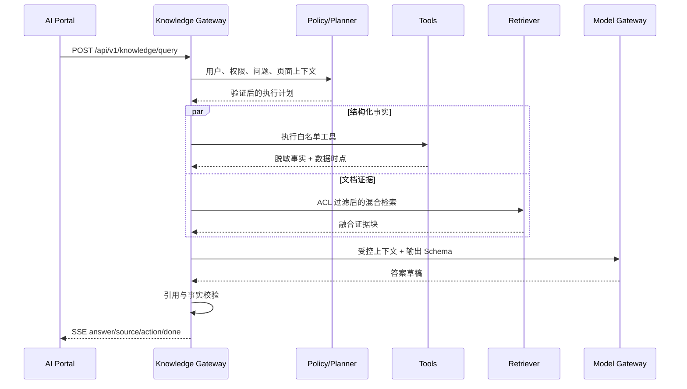

# 02 目标架构与核心流程

> 实施状态：**目标态设计，当前尚未实现。** 当前代码仍使用独立 `/api/v1/ai/*` 路由、同步 RAG 索引和单路向量检索；现状以 `01-现状基线与需求边界.md` 为准。

## 1. 架构风格

首期保持模块化单体，不拆分独立 Knowledge 微服务；增加独立 Worker 进程，但复用后端代码、模型和部署镜像。这样既隔离长耗时索引，又避免过早引入分布式一致性和额外运维系统。



## 2. 逻辑组件

### 2.1 AI Portal

职责：

- 提供以对话为主、卡片和动作确认为辅的统一体验；
- 传递页面上下文和用户明确选择，不自行推断权限；
- 消费统一 SSE 事件，不并行拼接两个互不一致的 AI 结果；
- 显示来源、数据时点、未知状态和待确认动作；
- 不在浏览器保存模型密钥、系统 Prompt 或敏感工具结果。

### 2.2 Knowledge Gateway

职责：

- 作为 AI 门户唯一的高层业务入口；
- 完成鉴权、限流、输入策略、意图规划、工具编排、检索、模型调用、引用校验、审计和流式响应；
- 生成统一 `trace_id`，贯穿模型、工具、检索和异步任务；
- 管理超时预算和降级，不让模型供应商错误扩散到核心业务。

建议模块边界：

```text
backend/app/knowledge/
  gateway.py             # 请求生命周期与预算
  planner.py             # 规则优先的意图和实体规划
  policy.py              # 权限、数据分级、动作策略
  tools/                 # 白名单业务工具
  retrieval/             # 精确、FTS、向量、融合、重排
  context.py             # 上下文预算与证据组装
  answer.py              # 生成、引用映射、事实校验
  sessions.py            # 可插拔会话存储接口
  feedback.py            # 反馈与评测样本
```

### 2.3 Query Planner

采用“规则优先、模型补充”的规划方式：

1. 先用规则识别产品编号、UUID、价格区间、状态、质量字段和显式页面上下文。
2. 再让模型在严格 JSON Schema 内补充意图、实体和需要的工具。
3. 服务端验证工具名、参数、权限和最大范围。
4. 规划失败时降级为只读关键词搜索，不执行写动作。

规划结果示例：

```json
{
  "intent": "product_compare",
  "entities": {"product_nos": ["A100", "A200"]},
  "required_tools": ["product.get_many", "product.compare"],
  "retrieval": {"enabled": true, "topics": ["工作温度", "安装"]},
  "answer_mode": "comparison",
  "proposed_action": null
}
```

### 2.4 Tool Registry

工具不是 HTTP API 的无约束转发，而是后端注册的领域服务调用。每个工具必须声明：

- 名称、版本、用途和参数 Schema；
- 所需权限和允许的数据级别；
- 只读或写入；
- 最大结果数、超时、是否可并行；
- 返回字段投影和敏感字段策略；
- 审计事件和幂等键规则。

首期只读工具：

| 工具 | 用途 | 主要权限 |
| --- | --- | --- |
| `product.search` | 结构化过滤和精确产品搜索 | `product:view` |
| `product.get_many` | 批量读取产品当前事实 | `product:view` |
| `product.compare` | 比较指定结构化字段 | `product:view` |
| `quality.summary` | 统计质量问题 | `stats:view` 或新 `quality:view` |
| `quality.list_issues` | 返回待修复产品列表 | `product:view` |
| `supplier.compare` | 比较当前 PIM 供应商字段 | `supplier:view` |
| `proposal.get` | 读取方案上下文 | `proposal:view` |

首期候选写工具：

| 工具 | 执行方式 | 权限 |
| --- | --- | --- |
| `proposal.create_draft` | 先返回待确认动作，确认后调用既有领域服务 | `proposal:create` |
| `proposal.update_draft` | 仅草稿，确认后执行 | `proposal:edit` |
| `share.create` | 只对已满足业务约束的对象，二次确认 | `share:create` |

不提供 `quotation.confirm`、`product.update`、`product.delete` 等高风险 AI 工具。

### 2.5 Knowledge Retriever

并行执行以下召回：

- 精确召回：产品编号、型号、文档标题、标准号、规格值；
- PostgreSQL 全文/关键词召回；
- pgvector 语义召回；
- 产品知识卡片召回；
- 元数据过滤：产品、类目、品牌、文档类型、有效状态、ACL。

结果使用 RRF 融合，首期不强制部署 reranker。只有离线评测证明收益显著且延迟、成本可接受时启用重排模型。

### 2.6 Model Gateway

在现有 Adapter 基础上增加业务级模型路由，不让业务模块感知供应商：

- `chat_generation`：回答生成；
- `query_planning`：严格结构化规划；
- `embedding`：文档和查询向量；
- `reranking`：可选；
- 每项能力记录供应商、模型、版本、超时、重试和成本单价。

首期使用一个主 Chat 模型和一个 Embedding 模型，不做运行时用户选模型。供应商切换由管理员配置、灰度和评测门禁控制。

### 2.7 Knowledge Worker

Worker 负责：附件解析、OCR、结构化切块、Embedding、原子索引替换、删除传播、批量重建和失败重试。

首期推荐使用 Redis Streams + Consumer Group：

- 项目已有 Redis，无需增加 RabbitMQ/Kafka；
- 任务状态仍以 PostgreSQL `knowledge_index_job` 为准，Redis 只负责投递；
- Worker 可从同一后端镜像启动不同 command；
- 数据库 Outbox 调度器把待投递任务写入 Stream；
- 消费至少一次，业务幂等保证重复执行安全。

不推荐只使用 Redis List，因为缺少可靠确认、Pending 检查和消费者恢复语义。

## 3. 统一查询流程



具体步骤：

1. 鉴权并解析用户角色、权限和数据策略。
2. 验证问题长度、附件、页面 scope 和会话 ID。
3. 识别高风险输入、Prompt 注入和敏感出域限制。
4. 规划意图与实体，匹配产品编号优先于语义搜索。
5. 并行执行工具和知识召回。
6. 融合证据，执行文档/产品配额，控制上下文 Token。
7. 构建带来源标识的数据包，模型只负责综合表达。
8. 校验回答中的价格、库存、供应商和引用。
9. 若需业务动作，生成 `pending_action` 而非直接执行。
10. 流式返回，写入无原文审计、指标和反馈关联记录。

## 4. 超时与降级预算

建议首期端到端首字节目标 2.5 秒，完整回答 P95 12 秒。一次查询预算：

| 环节 | 建议超时 | 降级 |
| --- | --- | --- |
| 权限与规则规划 | 200ms | 无法鉴权直接拒绝 |
| 模型规划 | 2s | 降级为关键词搜索/明确询问 |
| 单个业务工具 | 1s | 标记该事实不可用 |
| 混合检索 | 1.5s | 向量失败时保留精确/关键词 |
| 回答模型首 Token | 5s | 超时提示重试，保留检索结果 |
| 回答总时长 | 30s | 中止上游，返回已完成部分和错误事件 |

禁止对写工具自动重试。只读工具和模型请求最多一次带抖动重试，且必须仍在总预算内。

## 5. 部署拓扑

```text
nginx
  /              -> portal 静态资源
  /admin/        -> 现有 frontend 静态资源
  /api/          -> backend

backend x 1~N
knowledge-worker x 1~N
knowledge-dispatcher x 1（可先合并到 worker）
postgres + pgvector
redis
minio
gotenberg
ocr（按需启用）
```

首期不把主数据库拆开。若 AI 查询影响 PIM 主业务，优先通过查询索引、连接池隔离、Worker 并发限制和只读副本解决；只有实测达到拆分门槛才迁移独立知识库。

## 6. 拆分门槛

满足任一条件并有连续容量报告后，再评估独立检索服务或向量库：

- 知识块超过 300 万并持续快速增长；
- AI 检索使 PIM 核心接口 P99 连续违反 SLO；
- 向量查询需要独立扩缩容或 GPU 检索；
- 多租户需要物理隔离；
- PostgreSQL 在目标召回率下无法达到延迟门槛。
