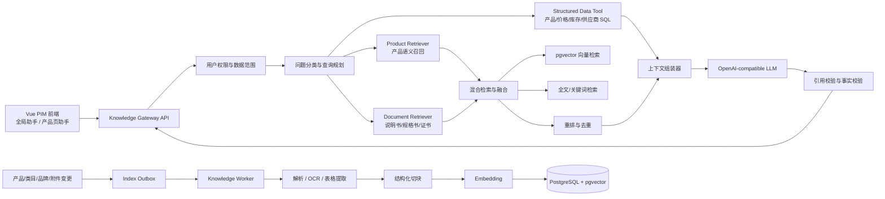

## 结论

对 AI-OpenPIM，最合适的不是再外挂一套独立的 Dify、FastGPT 或 RagFlow 知识库，而是建设：

> **PIM 内置 Knowledge Gateway + 结构化数据工具调用 + PostgreSQL 混合 RAG + 异步索引 Worker**

核心原则是：

* **价格、库存、供应商、状态等实时字段，查 PIM 数据库**
* **说明书、规格书、证书、产品描述等非结构化内容，走 RAG**
* **产品对比、选型、推荐等复杂问题，同时调用两条通道**
* **权限、数据范围、引用来源、审计均由 PIM 自己控制**
* 外部大模型平台只负责模型推理，不能成为产品数据的“第二真相源”

这是因为项目已经具备 FastAPI、PostgreSQL、pgvector、Redis、MinIO、OpenAI-compatible Adapter、SSE 对话、权限与审计等基础，不需要重新搭建一套平行系统。 ([GitHub][1])

---

# 一、推荐的总体架构



## 部署形态

继续保持当前模块化单体：

```text
frontend
backend
knowledge-worker     ← 新增，但复用 backend 镜像和代码
postgres + pgvector
redis
minio
ocr-service          ← 项目已有可选 OCR 能力
optional-reranker    ← 后期再加
```

当前项目规划本身倾向不急于拆微服务，也没有立即引入 MQ 和独立生产级向量平台的必要，因此 Knowledge Worker 可以先使用 Redis 队列或 Redis Streams，不需要 Kafka。 ([GitHub][2])

---

# 二、知识问答必须分成三种数据通道

这是整个架构最重要的一点。

## 1. 结构化事实通道

以下数据不能依赖文档向量检索：

* 当前价格、成本价
* 实时库存、库存状态
* 上下架状态
* 供应商
* 品牌、类目
* 产品编码
* 结构化规格属性
* 当前审核状态
* 数据完整度
* 最新更新时间

这些内容应该通过受控的 SQL Tool 或内部 Service 查询，例如：

```text
get_product(product_no)
search_products(filters)
get_product_inventory(product_id)
get_product_price(product_id)
compare_product_attributes(product_ids, attributes)
get_supplier_products(supplier_id)
```

项目当前的说明书问答逻辑已经主动禁止依据 RAG 内容回答价格、库存、供应商和成本等易变化字段，这个方向是正确的。 ([GitHub][3])

例如用户问：

> “A100 现在多少钱，还有库存吗？”

执行路径应当是：

```text
识别产品 A100
→ 调用产品查询工具
→ 从数据库读取实时价格、库存
→ LLM 只负责组织语言
```

不能先向量检索产品说明书，再让模型猜答案。

---

## 2. 非结构化文档通道

适合 RAG 的内容包括：

* 产品说明书
* 规格书
* 数据手册
* 合格证、认证证书
* 安装文档
* 售后与维护文档
* FAQ
* 产品长描述
* 适用场景和注意事项
* 历史技术资料

AI-OpenPIM 已有 `ProductManual`、`ProductManualChunk`、解析状态、索引状态、内容哈希和 `Vector(1536)` 等设计，也已经支持 PDF、DOCX、OCR、Embedding 和余弦检索，所以应在现有实现上扩展，而不是推倒重来。 ([GitHub][4])

---

## 3. 产品检索与选型通道

这一通道解决：

* “帮我找适合户外使用的防水摄像头”
* “找价格在某范围、支持 PoE 的型号”
* “A、B、C 三款产品有什么区别”
* “客户是医院，应该推荐哪个产品”
* “哪些产品满足 IP67、低温工作和远程管理”

它不是单纯的说明书问答，而是：

```text
结构化条件过滤
+ 产品语义召回
+ 产品文档证据
+ 实时字段补充
```

项目的 `Product` 模型已有 `vector Vector(1536)` 字段，也有品牌、类目、材质、规格、颜色、状态、价格等结构化字段，可以生成统一的“产品知识卡片”用于产品级语义检索。 ([GitHub][4])

产品知识卡片可以类似：

```text
产品名称：X200 工业摄像机
产品编码：X200
品牌：Example
类目：工业摄像机
核心规格：IP67，PoE，4K，-30℃～60℃
材质：铝合金
适用场景：厂区、仓储、户外安防
标签：防水、夜视、工业级
```

但价格、库存、供应商等实时字段不要写入卡片作为回答依据，而应在回答时现场查询。

---

# 三、检索层不要只做向量搜索

当前实现主要是：

```text
问题向量化
→ product_id 过滤
→ pgvector 余弦距离
→ Top-K
```

这适合验证，但生产级 PIM 问答会遇到明显问题：

* 型号、产品编码容易被语义向量弱化
* `AB-123X`、`IP67`、`GB/T 19001` 等精确词需要关键词匹配
* 相似产品可能很多，单纯向量结果不稳定
* 文档中表格、参数项经常只有少量关键词
* 多产品对比需要检索结果按产品和文档分组

当前代码的检索确实以向量和单个 `product_id` 过滤为主。 ([GitHub][5])

## 推荐采用混合检索

每次查询同时执行：

```text
A. 精确匹配：
   产品编码、型号、品牌、规格值、文档编号

B. 全文检索：
   PostgreSQL tsvector / GIN

C. 向量检索：
   pgvector cosine / inner product

D. 结构化过滤：
   product_id、category_id、brand_id、doc_type、status、ACL
```

然后采用 RRF 融合：

```text
RRF Score =
1 / (60 + keyword_rank)
+
1 / (60 + vector_rank)
+
业务权重
```

业务权重示例：

```text
精确命中产品编码：+高权重
命中文档标题：+中高权重
命中规格章节：+中权重
文档已失效：直接排除
产品已下架：按业务规则降权或提示
```

pgvector 官方也明确支持与 PostgreSQL 全文检索组合，并建议使用 Reciprocal Rank Fusion 或 cross-encoder 合并关键词和向量结果。 ([GitHub][6])

PostgreSQL 本身提供 `tsvector`、`tsquery`、`ts_rank`、`ts_rank_cd` 和 GIN 索引，可以承担第一阶段的关键词检索，不必立即引入 Elasticsearch。 ([PostgreSQL][7])

### 中文检索要额外处理

如果产品内容以中文为主，建议二选一：

1. 应用层使用中文分词，生成标准化检索词；
2. PostgreSQL 安装 `pg_jieba` 或 `zhparser`，建立中文 `tsvector`。

中文检索方案必须用真实产品型号、行业术语和规格参数单独测试，不能直接套用英文全文检索配置。中文分词扩展就是为这一问题提供专用分词能力。 ([AlibabaCloud][8])

---

# 四、重新设计知识表，而不是只扩展 manual_chunk

目前 `product_manual_chunk` 适合说明书试点，但未来会出现：

* 产品描述
* 类目知识
* 品牌资料
* FAQ
* 售后政策
* 培训文档
* 认证文件
* 企业制度
* 外部标准

因此建议抽象成通用知识模型。

## 1. knowledge_document

```sql
knowledge_document
------------------
id
source_type          -- manual/product/faq/category/brand/policy
source_id
product_id
category_id
brand_id
title
doc_type
version
language
content_hash
parse_status
index_status
is_active
effective_at
expired_at
acl_scope
metadata jsonb
created_at
updated_at
last_indexed_at
```

## 2. knowledge_chunk

```sql
knowledge_chunk
---------------
id
document_id
product_id
category_id
brand_id

chunk_index
section_path         -- 安装 > 网络配置 > PoE
page_number
chunk_type           -- paragraph/table/spec/warning/faq
chunk_text
normalized_text

text_search tsvector
embedding vector(1536)

token_count
embedding_model
embedding_version
metadata jsonb

created_at
updated_at
```

建议保留以下索引：

```sql
GIN(text_search)
HNSW(embedding vector_cosine_ops)
BTREE(product_id)
BTREE(category_id)
BTREE(brand_id)
BTREE(document_id, chunk_index)
BTREE(doc_type, is_active)
```

pgvector 在带过滤条件的 HNSW 查询中可能出现先近邻扫描、后过滤导致召回数量不足的问题；官方建议依据数据分布使用普通字段索引、部分索引、分区或者 iterative scan。因此产品、类目和租户过滤需要在数据量增长后专门做召回测试。 ([GitHub][6])

## 3. knowledge_index_job

```sql
knowledge_index_job
-------------------
id
source_type
source_id
operation            -- upsert/delete/reindex
status
content_hash
attempt_count
error_message
created_at
started_at
completed_at
```

它用于解决：

* 文档保存成功但索引失败
* 重复任务
* 模型切换后的批量重建
* 删除文档后的向量残留
* OCR 或解析任务超时
* 管理员查看索引进度

---

# 五、切块方式需要升级

项目当前是约 600 字符、80 字符重叠的固定长度切块。这适合快速实现，但不适合规格书和说明书，因为标题、参数和值可能被切散。 ([GitHub][5])

## 推荐切块优先级

```text
一级：文档标题
二级：章节标题
三级：段落
四级：列表
五级：表格行或规格项
最后才按 Token 长度截断
```

例如不要把：

```text
工作温度
-30℃～60℃
```

拆成两个块。

建议的块类型：

### 普通段落块

```json
{
  "section_path": "安装说明 > 环境要求",
  "chunk_type": "paragraph",
  "text": "设备应安装于……"
}
```

### 参数块

```json
{
  "section_path": "技术参数 > 环境参数",
  "chunk_type": "spec",
  "text": "工作温度：-30℃～60℃；防护等级：IP67"
}
```

### 表格块

```json
{
  "section_path": "型号对比",
  "chunk_type": "table",
  "text": "型号 X200｜分辨率 4K｜PoE 是｜防护等级 IP67"
}
```

### 警告块

```json
{
  "section_path": "安全事项",
  "chunk_type": "warning",
  "text": "严禁在……环境下使用。"
}
```

检索时可对 `warning`、`spec` 和精确型号块赋予更高权重。

---

# 六、统一问答执行流程

建议增加一个统一接口：

```http
POST /api/v1/knowledge/query
```

请求：

```json
{
  "query": "X200 和 X300 哪个更适合室外低温环境？现在是否有库存？",
  "scope": {
    "type": "global",
    "product_ids": []
  },
  "session_id": "xxx",
  "stream": true
}
```

## 内部执行步骤

### 第一步：身份和权限

先确定用户可以看到：

* 哪些产品
* 哪些供应商
* 成本价是否可见
* 内部文档是否可见
* 是否允许跨类目搜索

权限过滤必须在召回阶段完成，不能先召回敏感内容，再寄希望于模型不输出。

现有项目已经有 `ai:use` 权限、速率限制、对话审计和不记录原始 Prompt 的处理，可以直接复用。 ([GitHub][9])

### 第二步：查询规划

模型或规则分类器生成：

```json
{
  "intent": "product_compare",
  "entities": {
    "product_numbers": ["X200", "X300"],
    "attributes": ["工作温度", "户外适用性", "库存"]
  },
  "need_structured_data": true,
  "need_document_retrieval": true
}
```

不建议让大模型直接生成任意 SQL。应让模型从白名单工具中选择，参数再由后端校验。

### 第三步：产品实体解析

按顺序匹配：

```text
产品编码精确匹配
→ 型号别名
→ 产品名称
→ 品牌 + 型号
→ 产品语义搜索
```

产品编码命中后，应将对应 `product_id` 作为文档检索硬过滤条件。

### 第四步：并行检索

```text
SQL Tool：
查询 X200、X300 当前库存和结构化规格

全文检索：
检索“低温、工作温度、户外、环境要求”

向量检索：
检索“适合室外寒冷环境使用”
```

### 第五步：融合和重排

建议：

```text
向量 Top 30
关键词 Top 30
产品卡片 Top 10
↓
RRF 融合
↓
元数据与权限过滤
↓
按产品和文档去重
↓
可选 reranker
↓
最终 6～10 个证据块
```

不要让同一说明书相邻的六个块占满全部上下文。可以限制：

```text
每个文档最多 3 块
每个产品至少 1 块
优先保留规格块和警告块
```

### 第六步：生成回答

模型得到两类上下文：

```text
[实时结构化事实]
X200 库存状态：有货
X300 库存状态：缺货

[文档证据]
X200 说明书第 12 页：工作温度 -30℃～60℃
X300 规格书第 4 页：工作温度 -10℃～50℃
```

输出：

> X200 更适合室外低温环境。其说明书记载的最低工作温度为 -30℃，而 X300 为 -10℃。当前 X200 有货，X300 缺货。
>
> 来源：X200 说明书第 12 页；X300 规格书第 4 页。库存信息读取于 PIM 当前数据。

这样用户能够区分：

* 什么来自实时 PIM 数据
* 什么来自说明书
* 什么是模型根据证据得出的判断

---

# 七、建议的 API 划分

现有 `/chat`、`/embeddings`、`/rag/search`、`/rag/index` 可以保留作为底层接口。项目已经有流式 SSE、Embedding、RAG 搜索和索引路由。 ([GitHub][9])

上层增加：

```text
POST /knowledge/query
统一知识问答

POST /knowledge/search
只检索，不调用 LLM，方便调试

POST /knowledge/documents/{id}/reindex
重建单个知识源

POST /knowledge/reindex
按产品、类目、来源类型批量重建

GET /knowledge/jobs/{job_id}
查询索引任务

POST /knowledge/feedback
记录答案是否有用、引用是否正确

GET /knowledge/sources/{source_id}
打开来源文档或产品记录
```

统一返回结构建议：

```json
{
  "answer": "...",
  "facts": [
    {
      "field": "stock_status",
      "value": "in_stock",
      "source": "pim_database"
    }
  ],
  "sources": [
    {
      "document_id": 42,
      "product_id": 10,
      "title": "X200 产品说明书",
      "page": 12,
      "section": "环境参数",
      "quote": "工作温度：-30℃～60℃",
      "score": 0.91
    }
  ],
  "tool_calls": [
    {
      "name": "get_product_inventory",
      "status": "success"
    }
  ],
  "confidence": "high",
  "insufficient_sources": false,
  "trace_id": "..."
}
```

---

# 八、索引更新机制

不建议由保存产品的接口同步调用 Embedding，因为这样会让：

* 保存产品变慢
* 大模型接口故障影响正常 PIM 操作
* 批量导入时大量超时
* 重试容易产生重复向量
* 文档解析失败难以追踪

## 推荐使用 Outbox

```text
用户更新产品或上传说明书
→ 正常事务保存 PIM 数据
→ 同事务写入 knowledge_index_job
→ Worker 异步消费
→ 解析、切块、Embedding
→ 原子替换旧索引
→ 更新 last_indexed_at
```

每个任务通过：

```text
source_type + source_id + content_hash + embedding_version
```

保证幂等。

当前代码已经使用内容哈希判断文档变化，并在重建时替换旧块，这部分可以迁移到 Worker。 ([GitHub][5])

## 产品数据发生变化时

并非所有字段都需要重新 Embedding：

```text
名称、描述、材质、规格、标签变化
→ 重建产品知识卡片向量

价格、库存、成本变化
→ 不重建向量，只更新结构化字段

说明书附件变化
→ 重新解析并索引对应文档
```

这能显著减少无意义的 Embedding 调用。

---

# 九、Embedding 模型要做版本管理

当前数据库字段固定为 `Vector(1536)`，OpenAI-compatible 适配器也支持 Embedding，但未来更换模型时可能出现维度变化。 ([GitHub][10])

建议增加：

```text
embedding_model
embedding_dimension
embedding_version
indexed_at
```

不要直接在生产库里把现有 1536 维列改成另一个维度。更稳妥的方式是：

```text
新增 embedding_v2 列或新索引表
→ 后台重建
→ 双读验证
→ 切换检索
→ 删除旧索引
```

第一阶段继续使用现有 1536 维设计即可，避免一次改动过大。

---

# 十、问答的前端入口

建议设置三个入口，但共用同一个后端 Knowledge Gateway。

## 全局 AI 助手

支持：

* 全库产品搜索
* 产品选型
* 多产品比较
* 数据完整性查询
* 跨文档问答

## 产品详情页助手

自动带入：

```json
{
  "scope": {
    "type": "product",
    "product_ids": [123]
  }
}
```

适合：

* “怎么安装？”
* “支持什么协议？”
* “工作温度是多少？”
* “有哪些注意事项？”

## 类目或商品列表页助手

自动带入当前筛选条件：

```json
{
  "category_id": 8,
  "brand_ids": [2, 5],
  "status": "active"
}
```

适合：

* “这些产品里哪些支持 PoE？”
* “把适合室外使用的列出来”
* “比较当前选中的五款商品”

---

# 十一、哪些组件现在不建议引入

## 不建议立即使用独立向量数据库

当前阶段不建议上：

* Milvus
* Weaviate
* Qdrant
* Pinecone
* Elasticsearch Vector

原因不是这些产品不好，而是 AI-OpenPIM 已经使用 PostgreSQL 和 pgvector，并且问答需要大量进行：

```text
向量检索
+ product_id 过滤
+ 类目过滤
+ 权限过滤
+ 产品表 JOIN
+ 文档状态过滤
```

把向量放进独立数据库会增加：

* 数据同步
* 删除一致性
* 权限一致性
* 产品状态同步
* 运维和备份
* 跨库查询复杂度

pgvector 本来就主打向量和业务数据共库，并支持精确与近似检索、过滤、分区和混合全文检索。 ([GitHub][6])

只有出现以下情况，再评估独立向量库：

* 知识块达到数百万至千万级
* 向量检索需要独立扩缩容
* 高并发检索明显拖慢 PIM 主库
* 大规模多租户需要强隔离
* 多模态向量种类大幅增加
* PostgreSQL 实测延迟或召回无法达标

更早的优化方式是先把知识表放进独立 PostgreSQL schema，之后再拆成独立知识库实例，而不是一开始就换技术体系。

---

## 不建议让 Dify/FastGPT 成为知识中心

项目的 Adapter 已经考虑与 FastGPT、Dify、RagFlow 等系统解耦，这意味着它们可以作为可替换的模型或流程适配器，但不应该拥有 PIM 的核心知识状态。 ([GitHub][11])

可以使用它们做：

* Prompt 试验
* 临时工作流
* 外部机器人
* 非核心知识问答
* 模型供应商切换

但以下能力必须留在 PIM：

* 用户权限
* 产品数据范围
* 价格和库存读取
* 文档版本
* 产品与文档关联
* 索引状态
* 来源跳转
* 审计日志
* 删除和失效传播

否则会出现：

> PIM 中产品已经下架，但外部知识库仍然回答；
> 用户无权查看成本价，但外部平台已经把成本内容召回。

---

# 十二、建议的落地阶段

## 第一阶段：把现有 RAG 做正确

完成：

* 建立统一 `/knowledge/query`
* 增加结构化产品查询工具
* 把固定字符切块改成章节、段落、表格切块
* 增加页码、章节、块类型和文档版本
* 将索引迁移到异步 Worker
* 继续使用 PostgreSQL + pgvector
* 所有回答展示来源
* 价格、库存等字段强制实时查询

这一阶段已经能够覆盖大部分实际 PIM 问答。

## 第二阶段：提升搜索质量

完成：

* 中文全文检索
* 向量与关键词混合召回
* RRF 融合
* 产品知识卡片
* 多产品比较
* 可选 reranker
* 用户反馈和无答案机制
* 检索调试后台

## 第三阶段：规模化和治理

完成：

* Embedding 双版本切换
* 知识有效期
* 文档级 ACL
* 多租户隔离
* 离线评测集
* 检索性能监控
* 多模态图片与表格理解
* 根据实际规模决定是否拆独立检索服务

---

# 十三、最终推荐方案

对这个项目，我会采用下面的技术组合：

| 模块        | 推荐方案                         |
| --------- | ---------------------------- |
| 系统形态      | 模块化单体 + 独立 Worker 进程         |
| 业务真相源     | PostgreSQL PIM 结构化表          |
| 文档存储      | MinIO                        |
| 文档元数据     | PostgreSQL                   |
| 向量检索      | 现有 pgvector                  |
| 关键词检索     | PostgreSQL FTS，中文增加分词        |
| 混合排序      | RRF，后期增加 reranker            |
| 异步索引      | Redis 队列或 Redis Streams      |
| 模型接入      | 沿用 OpenAI-compatible Adapter |
| 问答编排      | FastAPI 内置 Knowledge Gateway |
| 动态数据      | 白名单 SQL/Service Tools        |
| 权限        | 检索前过滤                        |
| 引用        | 产品、文档、章节、页码四级引用              |
| 外部 Dify 等 | 只作为可选工作流层，不拥有核心索引            |

一句话概括就是：

> **把 AI 建成 PIM 的一个原生查询层，而不是把 PIM 数据复制给另一个 AI 系统。**

这样既能充分复用 AI-OpenPIM 现有代码，也能保证价格库存准确、文档回答有出处、权限不泄漏，并且将来需要拆分检索服务时仍然有清晰的边界。

[1]: https://github.com/tyche66/AI-OpenPIM "GitHub - tyche66/AI-OpenPIM · GitHub"
[2]: https://github.com/tyche66/AI-OpenPIM/blob/main/docs/v1.2-plan.md "AI-OpenPIM/docs/v1.2-plan.md at main · tyche66/AI-OpenPIM · GitHub"
[3]: https://github.com/tyche66/AI-OpenPIM/blob/main/backend/app/api/v1/manuals.py "AI-OpenPIM/backend/app/api/v1/manuals.py at main · tyche66/AI-OpenPIM · GitHub"
[4]: https://github.com/tyche66/AI-OpenPIM/blob/main/backend/app/models/product.py "AI-OpenPIM/backend/app/models/product.py at main · tyche66/AI-OpenPIM · GitHub"
[5]: https://github.com/tyche66/AI-OpenPIM/blob/main/backend/app/services/rag_index.py "AI-OpenPIM/backend/app/services/rag_index.py at main · tyche66/AI-OpenPIM · GitHub"
[6]: https://github.com/pgvector/pgvector/blob/master/README.md?utm_source=chatgpt.com "pgvector/README.md at master · pgvector/pgvector · GitHub"
[7]: https://www.postgresql.org/docs/current/textsearch.html?utm_source=chatgpt.com "PostgreSQL: Documentation: 18: Chapter 12. Full Text Search"
[8]: https://www.alibabacloud.com/help/en/polardb/polardb-for-postgresql/pg-jieba?utm_source=chatgpt.com "What is the pg_jieba extension - PolarDB - Alibaba Cloud Documentation Center"
[9]: https://github.com/tyche66/AI-OpenPIM/blob/main/backend/app/api/v1/ai.py "AI-OpenPIM/backend/app/api/v1/ai.py at main · tyche66/AI-OpenPIM · GitHub"
[10]: https://github.com/tyche66/AI-OpenPIM/blob/main/backend/app/adapters/openai.py "AI-OpenPIM/backend/app/adapters/openai.py at main · tyche66/AI-OpenPIM · GitHub"
[11]: https://github.com/tyche66/AI-OpenPIM/blob/main/backend/app/adapters/base.py "AI-OpenPIM/backend/app/adapters/base.py at main · tyche66/AI-OpenPIM · GitHub"
