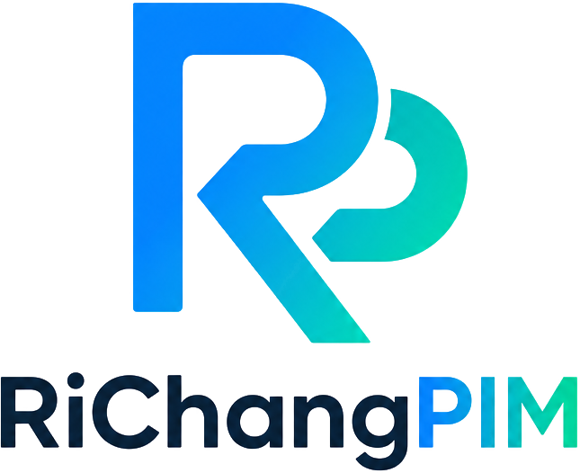
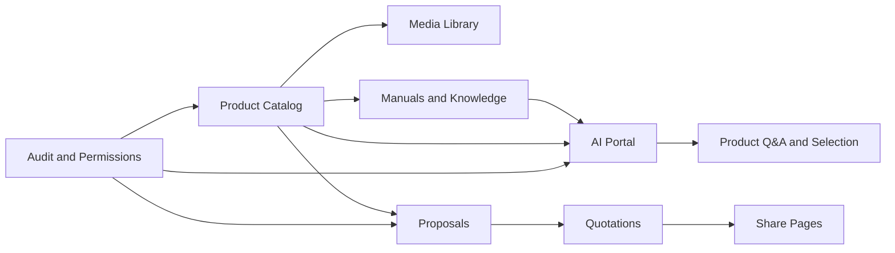
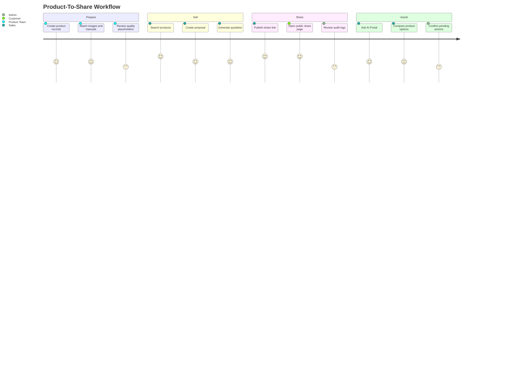
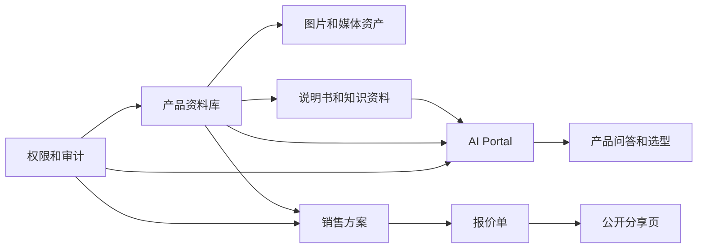
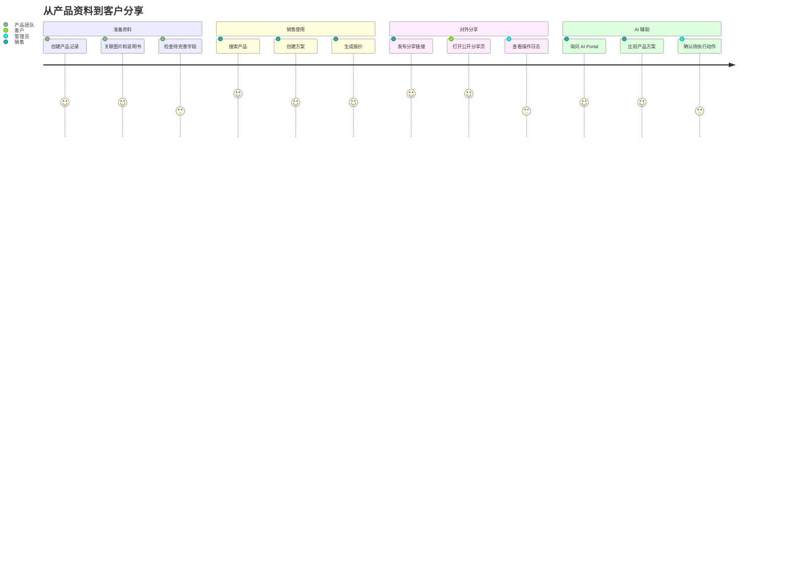

<p align="center">
  
</p>

<h1 align="center">AI OpenPIM</h1>

<p align="center">
  An open-source PIM for product teams, sales teams, media assets, quotations, sharing pages, and AI-assisted product workflows.
</p>

<p align="center">
  <a href="https://github.com/tyche66/AI-OpenPIM"></a>
  
  
  
  
</p>

---

## Why OpenPIM

Product information is usually scattered across spreadsheets, folders, images, manuals, quotation files, and private chat history. OpenPIM turns that scattered work into a structured workspace:

| Before | With OpenPIM |
| --- | --- |
| Product data lives in spreadsheets | Product data has searchable records and lifecycle states |
| Images and manuals are separated from products | Media, scene images, manuals, and product records stay connected |
| Sales proposals are rebuilt manually | Proposals, quotations, and share pages can reuse product data |
| AI answers are detached from business context | AI workflows can use controlled product and knowledge context |
| Auditing is an afterthought | Logs, permissions, and quality views are part of the workflow |

OpenPIM is designed as a practical community edition: useful enough to explore real PIM workflows, clean enough to publish, and free of private deployment details or customer data.

## What You Can Build With It



## Highlights

| Area | What It Covers |
| --- | --- |
| Product Management | Products, categories, brands, suppliers, tags, status, completeness fields, and placeholder sample data |
| Media and Manuals | Product images, scene images, media library, manuals, parsing states, and attachment workflows |
| Sales Workflows | Proposals, quotation generation, sharing links, share management, and public share pages |
| AI Experience | Separate AI Portal, product-aware conversations, recommended products, source cards, pending actions, and controlled answers |
| Quality Views | Missing data indicators, placeholder price handling, draft status visibility, and quality-oriented lists |
| Permissions and Audit | Role-aware views, permission checks, operation logs, login/logout tracing, and safer audit display |

## Product Experience Map



## Repository Layout

| Path | Purpose |
| --- | --- |
| `backend/` | FastAPI service, database models, business APIs, AI/knowledge services, background scripts, and tests |
| `frontend/` | Admin console built with Vue 3, Vite, Element Plus, and Pinia |
| `portal/` | Lightweight AI Portal for product Q&A and guided interaction |
| `docker/` | Container support files for local services |
| `scripts/` | Local helper scripts, health checks, backup helpers, demo launcher, and secret scanning |
| `.env.example` | Public placeholder environment template |

## Quick Start

Start from placeholder configuration. Never put real secrets into Git.

```bash
cp .env.example .env
docker compose -f docker-compose.dev.yml up -d
```

Run the backend:

```bash
cd backend
python -m venv venv
source venv/bin/activate
pip install -r requirements.txt
uvicorn app.main:app --reload --host 0.0.0.0 --port 8000
```

Run the admin console:

```bash
cd frontend
npm install
npm run dev
```

Run the AI Portal:

```bash
cd portal
npm install
npm run dev
```

## Demo Surface

| App | Default Local Role |
| --- | --- |
| Admin Console | Manage products, media, proposals, quotations, users, roles, and logs |
| AI Portal | Ask product questions, compare options, inspect sources, and continue guided workflows |
| Public Share Page | View shared proposal/quotation content without exposing admin-only screens |

## Community Edition Boundary

This repository intentionally does not include private or customer-specific material.

| Not Included | Why |
| --- | --- |
| Real `.env` files and production secrets | They must stay outside Git |
| Provider API keys, tokens, TLS keys, certificates | They are replaced by placeholders or excluded |
| Customer product data and private samples | The community edition uses generic sample placeholders |
| Internal runbooks, review records, and architecture documents | The public repo focuses on runnable code and a concise project overview |
| Local logs, database volumes, build outputs, dependency folders | They are runtime artifacts, not source code |

## Safe Publishing Checklist

Before publishing changes, run the secret scanner:

```bash
bash scripts/secret_scan.sh
```

Recommended local checks:

```bash
cd frontend
npm run build
npm run test
```

```bash
cd portal
npm run build
```

## Project Status

| Item | Status |
| --- | --- |
| Community Edition | Sanitized and public |
| Current App Version | `1.8.5` |
| Admin Console | Included |
| AI Portal | Included |
| Example Data | Generic placeholder data only |
| Technical Design Docs | Not included in this public edition |

## License

See `LICENSE`.

---

# AI OpenPIM 中文版

AI OpenPIM 是一个开源的产品信息管理系统，面向产品团队、销售团队、媒体资产管理、报价分享和 AI 辅助选品等场景。

它不是一个只保存商品字段的后台表单，而是把产品资料、图片、说明书、方案、报价、分享页和 AI 对话串成一条可落地的业务工作流。

## 为什么需要 OpenPIM

产品信息往往散落在 Excel、网盘文件夹、图片库、说明书、报价单、聊天记录和销售个人电脑里。OpenPIM 希望把这些碎片统一到一个可维护、可搜索、可复用的产品工作台。

| 常见问题 | OpenPIM 的处理方式 |
| --- | --- |
| 产品资料散落在表格和文件夹 | 建立可搜索、可维护的产品记录 |
| 图片、场景图、说明书和产品脱节 | 媒体资源和产品资料关联管理 |
| 销售方案和报价反复手工制作 | 方案、报价和分享页复用产品数据 |
| AI 回答缺少业务上下文 | AI Portal 可围绕受控产品资料进行问答和选型 |
| 权限、审计和质量检查后置 | 权限、日志和质量视图内置到日常流程中 |

## 可以用它做什么



## 功能亮点

| 模块 | 能力 |
| --- | --- |
| 产品管理 | 产品、分类、品牌、供应商、标签、状态、完整性字段和示例占位数据 |
| 媒体和说明书 | 产品图片、场景图、媒体库、说明书、解析状态和附件流程 |
| 销售流程 | 方案、报价、分享链接、分享管理和公开分享页 |
| AI 体验 | 独立 AI Portal、产品问答、推荐产品、来源卡片、待确认动作和受控回答 |
| 质量视图 | 缺失字段提示、占位价格处理、草稿状态识别和质量列表 |
| 权限与审计 | 角色感知界面、权限检查、操作日志、登录登出追踪和更安全的日志展示 |

## 产品体验路径



## 目录说明

| 路径 | 说明 |
| --- | --- |
| `backend/` | 后端服务、数据模型、业务接口、AI/知识服务、脚本和测试 |
| `frontend/` | 管理后台，基于 Vue 3、Vite、Element Plus 和 Pinia |
| `portal/` | 独立 AI Portal，用于产品问答和引导式交互 |
| `docker/` | 本地服务容器相关文件 |
| `scripts/` | 本地辅助脚本、健康检查、备份辅助、演示入口和密钥扫描 |
| `.env.example` | 公开占位环境变量模板 |

## 快速启动

先从占位配置开始。不要把真实密钥写入 Git。

```bash
cp .env.example .env
docker compose -f docker-compose.dev.yml up -d
```

启动后端：

```bash
cd backend
python -m venv venv
source venv/bin/activate
pip install -r requirements.txt
uvicorn app.main:app --reload --host 0.0.0.0 --port 8000
```

启动管理后台：

```bash
cd frontend
npm install
npm run dev
```

启动 AI Portal：

```bash
cd portal
npm install
npm run dev
```

## 三个主要入口

| 入口 | 用途 |
| --- | --- |
| 管理后台 | 管理产品、媒体、方案、报价、用户、角色和日志 |
| AI Portal | 进行产品问答、比较选项、查看来源并继续引导式工作流 |
| 公开分享页 | 在不暴露后台页面的情况下展示对外分享内容 |

## 社区版边界

这个仓库是已脱敏的社区开源版，不包含私有或客户专属资料。

| 不包含 | 原因 |
| --- | --- |
| 真实 `.env` 文件和生产密钥 | 必须保存在 Git 之外 |
| Provider API Key、Token、TLS 私钥、证书 | 使用占位符或直接排除 |
| 客户产品数据和私有样例 | 社区版只保留通用占位数据 |
| 内部运维记录、审查记录和架构设计文档 | 公开仓库聚焦可运行代码和项目概览 |
| 本地日志、数据库卷、构建产物、依赖目录 | 这些是运行时产物，不是源码 |

## 发布前安全检查

发布变更前建议运行：

```bash
bash scripts/secret_scan.sh
```

常用本地检查：

```bash
cd frontend
npm run build
npm run test
```

```bash
cd portal
npm run build
```

## 项目状态

| 项目 | 状态 |
| --- | --- |
| 社区开源版 | 已脱敏并公开 |
| 当前应用版本 | `1.8.5` |
| 管理后台 | 已包含 |
| AI Portal | 已包含 |
| 示例数据 | 仅使用通用占位数据 |
| 技术设计文档 | 不包含在公开社区版中 |

## 许可证

见 `LICENSE`。
