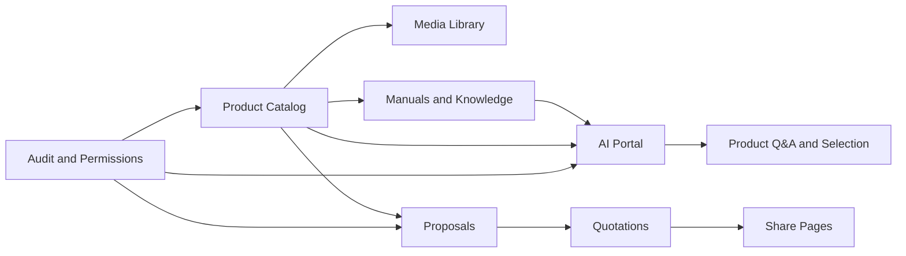
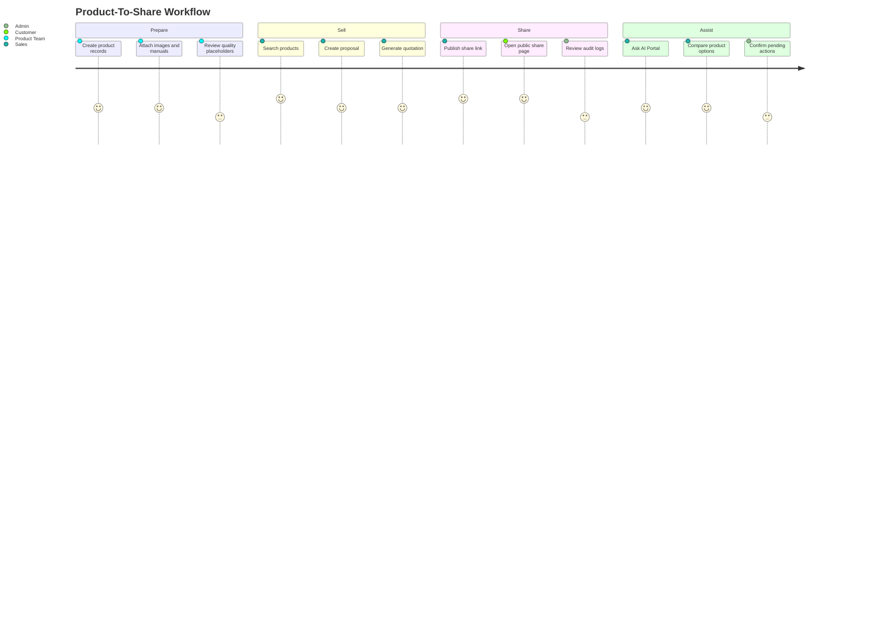

<p align="center">
  
</p>

<h1 align="center">AI OpenPIM</h1>

<p align="center">
  An open-source PIM for product teams, sales teams, media assets, quotations, sharing pages, and AI-assisted product workflows.
</p>

<p align="center">
  <a href="https://github.com/tyche66/AI-OpenPIM"></a>
  
  
  
  
</p>

---

## Why OpenPIM

Product information is usually scattered across spreadsheets, folders, images, manuals, quotation files, and private chat history. OpenPIM turns that scattered work into a structured workspace:

| Before | With OpenPIM |
| --- | --- |
| Product data lives in spreadsheets | Product data has searchable records and lifecycle states |
| Images and manuals are separated from products | Media, scene images, manuals, and product records stay connected |
| Sales proposals are rebuilt manually | Proposals, quotations, and share pages can reuse product data |
| AI answers are detached from business context | AI workflows can use controlled product and knowledge context |
| Auditing is an afterthought | Logs, permissions, and quality views are part of the workflow |

OpenPIM is designed as a practical community edition: useful enough to explore real PIM workflows, clean enough to publish, and free of private deployment details or customer data.

## What You Can Build With It



## Highlights

| Area | What It Covers |
| --- | --- |
| Product Management | Products, categories, brands, suppliers, tags, status, completeness fields, and placeholder sample data |
| Media and Manuals | Product images, scene images, media library, manuals, parsing states, and attachment workflows |
| Sales Workflows | Proposals, quotation generation, sharing links, share management, and public share pages |
| AI Experience | Separate AI Portal, product-aware conversations, recommended products, source cards, pending actions, and controlled answers |
| Quality Views | Missing data indicators, placeholder price handling, draft status visibility, and quality-oriented lists |
| Permissions and Audit | Role-aware views, permission checks, operation logs, login/logout tracing, and safer audit display |

## Product Experience Map



## Repository Layout

| Path | Purpose |
| --- | --- |
| `backend/` | FastAPI service, database models, business APIs, AI/knowledge services, background scripts, and tests |
| `frontend/` | Admin console built with Vue 3, Vite, Element Plus, and Pinia |
| `portal/` | Lightweight AI Portal for product Q&A and guided interaction |
| `docker/` | Container support files for local services |
| `scripts/` | Local helper scripts, health checks, backup helpers, demo launcher, and secret scanning |
| `.env.example` | Public placeholder environment template |

## Quick Start

Start from placeholder configuration. Never put real secrets into Git.

```bash
cp .env.example .env
docker compose -f docker-compose.dev.yml up -d
```

Run the backend:

```bash
cd backend
python -m venv venv
source venv/bin/activate
pip install -r requirements.txt
uvicorn app.main:app --reload --host 0.0.0.0 --port 8000
```

Run the admin console:

```bash
cd frontend
npm install
npm run dev
```

Run the AI Portal:

```bash
cd portal
npm install
npm run dev
```

## Demo Surface

| App | Default Local Role |
| --- | --- |
| Admin Console | Manage products, media, proposals, quotations, users, roles, and logs |
| AI Portal | Ask product questions, compare options, inspect sources, and continue guided workflows |
| Public Share Page | View shared proposal/quotation content without exposing admin-only screens |

## Community Edition Boundary

This repository intentionally does not include private or customer-specific material.

| Not Included | Why |
| --- | --- |
| Real `.env` files and production secrets | They must stay outside Git |
| Provider API keys, tokens, TLS keys, certificates | They are replaced by placeholders or excluded |
| Customer product data and private samples | The community edition uses generic sample placeholders |
| Internal runbooks, review records, and architecture documents | The public repo focuses on runnable code and a concise project overview |
| Local logs, database volumes, build outputs, dependency folders | They are runtime artifacts, not source code |

## Safe Publishing Checklist

Before publishing changes, run the secret scanner:

```bash
bash scripts/secret_scan.sh
```

Recommended local checks:

```bash
cd frontend
npm run build
npm run test
```

```bash
cd portal
npm run build
```

## Project Status

| Item | Status |
| --- | --- |
| Community Edition | Sanitized and public |
| Current App Version | `1.8.5` |
| Admin Console | Included |
| AI Portal | Included |
| Example Data | Generic placeholder data only |
| Technical Design Docs | Not included in this public edition |

## License

See `LICENSE`.
