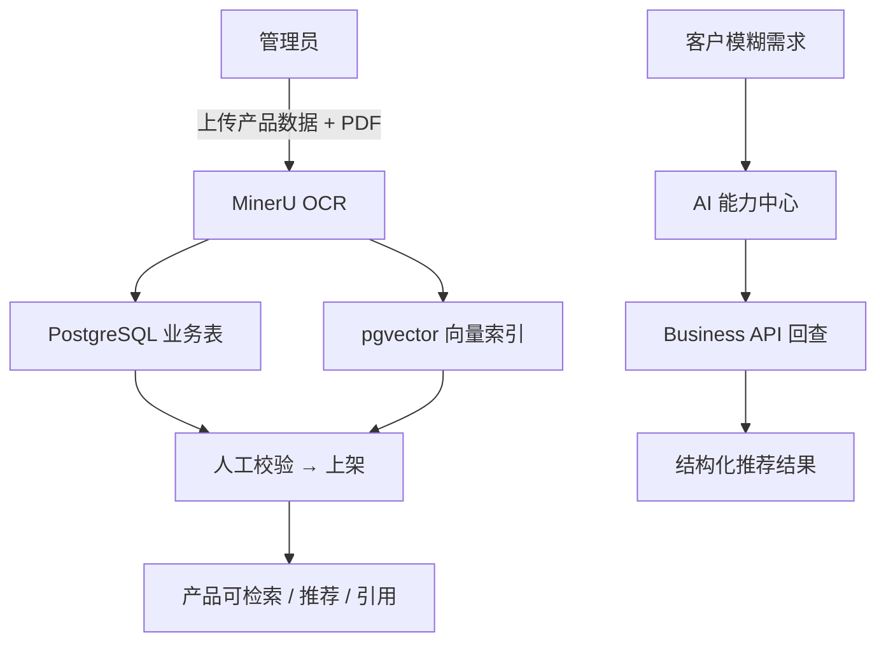
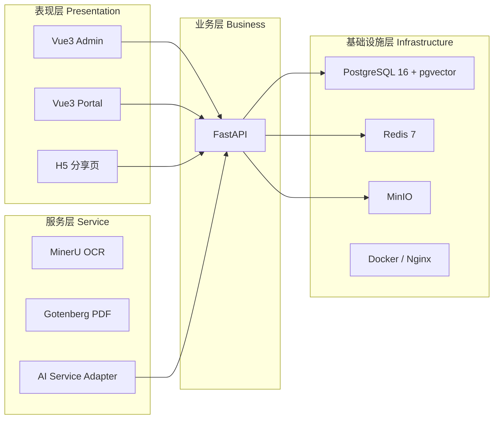

<!-- 语言切换 / Language Switch -->
<p align="center">
  <a href="README.md">🇨🇳 中文</a> · <a href="README_EN.md">🇺🇸 English</a>
</p>

<!-- Logo -->
<p align="center">
  
</p>

<!-- Hero -->
<p align="center">
  <strong>AI-PIM OpenPIM</strong> — 开源产品信息管理平台<br/>
  <sub>AI 赋能 · 结构化数据 · 媒体资产 · 方案分享 · 知识网关</sub>
</p>

<p align="center">
  
  
  
  
  
  
  
</p>

<p align="center">
  <a href="#项目概述">概述</a> ·
  <a href="#功能亮点">亮点</a> ·
  <a href="#数据可视化">数据看板</a> ·
  <a href="#架构总览">架构</a> ·
  <a href="#快速开始">快速开始</a> ·
  <a href="#文档">文档</a>
</p>

---

> 这份 README 按常见项目文档结构组织，同时保留当前快照的代码索引、启动方式、数据位置和产品信息落点，便于交接、排障和复现。

## 项目概述

| 项目项 | 当前状态 |
| --- | --- |
| 仓库根目录 | `OpenPIM/` |
| 后端 | `backend/`，FastAPI + SQLAlchemy + Alembic |
| 前端 | `frontend/`，Vue 3 + Vite + Element Plus + Pinia |
| AI 门户 | `portal/`，独立 AI 对话门户 |
| 数据库 | PostgreSQL 16 + pgvector |
| 缓存 | Redis 7 |
| 对象存储 | MinIO |
| 文档转换 | Gotenberg 8 |
| OCR 服务 | `docker/ocr/` 容器内独立服务 |
| AI 默认状态 | `AI_ADAPTER=openai`，`AI_CHAT_MODEL=gpt-4o-mini` |
| Knowledge Gateway | 默认启用（`KNOWLEDGE_GATEWAY_ENABLED=1`）|
| 当前正式版本 | **v1.9.1**（版本号声明位置见 [CHANGELOG.md](CHANGELOG.md)） |
| 当前迁移 head | `0017_operation_log_username` |
| 生产入口 | `http://127.0.0.1:888/`（Docker nginx `888:80`；门户 / 分享页 `/share/{token}` / `/admin/` / `/api/v1/*`） |
| 管理后台入口 | `http://127.0.0.1:888/admin/`（生产 nginx）或 `http://127.0.0.1:5173/admin/`（演示服务器，公网隧道走它） |
| 环境体检 | `bash scripts/where-am-i.sh`（**每次开工第一条命令**） |
| 实机运维口径 | [README-OPS.md](README-OPS.md)、`/home/AI-PIM/从启动到穿透.md` |
| 整机迁移 / 灾难恢复 | [MIGRATION_BUNDLE.md](MIGRATION_BUNDLE.md)（全量备份迁移包怎么打、怎么恢复） |
| 云端生产升级 | [docs/云端更新包.md](docs/云端更新包.md) |
| 数据卷 | [docs/数据卷与持久化存储.md](docs/数据卷与持久化存储.md) |
| MinIO | [docs/MinIO对象存储.md](docs/MinIO对象存储.md) |
| 主要种子入口 | `backend/app/scripts/seed_data.py` + `backend/alembic/versions/0004_seed_data.py` |
| 产品试点数据文件 | `backend/data/sunon_pilot_products.json` |

---

## 功能亮点

<div align="center">

| 🏷️ 产品与分类 | 📥 批量导入 | 🖼️ 媒体资产 | 💬 AI 门户 | 📊 数据看板 |
|---|---|---|---|---|
| 分类 / 品牌 / 标签 / 供应商管理 | Excel / XLSM / ZIP 批量导入 | 产品图、场景图、说明书、缩略图 | AI 对话、知识检索、方案润色 | 质量完整性、操作审计、统计看板 |

</div>

- **产品、分类、品牌、供应商、标签管理**
- **产品导入导出与试点数据导入**（`backend/app/scripts/import_sunon_products.py` 幂等、可校验、可更新）
- **Excel / XLSM 内嵌图片、ZIP 图片和产品图 / 场景图批量导入**
- **导入模板下载、按行隔离失败、图片 SHA-256 去重和 MinIO 上传**
- **方案、报价、分享页与权限控制**（`ShareToken` 统一管理访问凭证）
- **产品图片、场景图、说明书与媒体库管理**（`derived/thumb/w{width}/...` 缩略图缓存）
- **质量看板与数据完整性辅助视图**（`backend/app/services/quality_*.py`）
- **OCR、AI 能力中心与 RAG 相关基础设施**（`AIServiceAdapter` 可插拔抽象）

---

## 数据可视化

> 当前快照关键指标一览，便于快速评估项目规模与状态。

| 指标类别 | 数值 | 说明 |
|---|---|---|
| 📄 代码文件变更 | **213 files** | `+29,419 / −1,303` 行 |
| 🏷️ 正式版本 | **v1.9.1** | 见 [CHANGELOG.md](CHANGELOG.md) |
| 🗄️ 数据库迁移头 | **`0017_operation_log_username`** | Alembic 迁移链完整 |
| 🏛️ 核心数据表 | **23 张** | 用户 / 产品 / 方案 / 报价 / 分享 / 审计（见 `docs/02-系统架构与设计(HLD).md` §五） |
| 🏗️ 架构分层 | **4 层** | 表现层 · 业务层 · 服务层 · 基础设施层 |
| 🔧 核心业务中心 | **12 个** | 按基座 / 基础数据 / 核心实体 / 销售交易 / 分析五大类划分 |
| 🧩 产品模型字段 | **20+** | `product_no` / `brand_id` / `supplier_id` / `category_id` / `face_price` / `cost_price` / `material` / `stock_status` / `status` / `description` / `specification` / `colors` / `data_source` / `completeness_status` / `tags` / `images` / `scene_images` 等 |
| 🔐 权限级别 | **字段级** | 销售角色屏蔽 `cost_price` / 供应商链；采购角色可见完整成本链 |
| 📦 对象存储桶 | **`ai-pim`** | MinIO 默认 bucket，含缩略图派生对象 `derived/thumb/` |
| 🤖 AI 适配器 | **可插拔** | `openai` 默认，下游引擎（FastGPT / Dify / RagFlow）零改造切换 |

### 数据流概览



---

## 架构总览

AI-PIM 采用标准的**互联网企业级四层软件架构**，核心原则：**业务逻辑由数据库与 Business API 维护，AI 只负责理解、生成与推荐，所有业务统一走 Business API。**



> 完整架构说明、模块依赖关系、数据流（产品上传 / AI 推荐 / 方案分享）、缓存策略、接口规范见 [docs/02-系统架构与设计(HLD).md](docs/02-系统架构与设计(HLD).md)。

---

## 目录结构

### 仓库根目录

- `README.md`：当前总览文档
- `README_EN.md`：英文版总览
- `docker-compose.yml`：生产编排
- `docker-compose.dev.yml`：开发依赖编排
- `.env.example`：根级环境变量示例
- `.env`：当前本地开发环境变量
- `scripts/`：环境体检（`where-am-i.sh`）、前端构建（`build_frontends.sh`）、演示服务器、备份、恢复、健康检查、TLS 生成、发布门禁等脚本
- `docs/`：当前需求、架构、数据库、接口、部署、测试和存储文档
- `docs/过时/`：历史设计、规划、审查和旧部署文档，仅供追溯
- `AI-Docs/`：独立的可插拔 AI 设计、规划和扩展文档
- `backups/`：数据库备份与恢复演练文件
- `docker/`：Nginx、Postgres 初始化、OCR 容器等基础设施配置

### 后端代码 `backend/`

- `backend/app/main.py`：后端应用入口
- `backend/app/api/v1/`：所有 API 路由
- `backend/app/core/`：配置、数据库、权限、序列化、MinIO、速率限制等核心能力
- `backend/app/models/`：ORM 模型定义（含 `Product` / `Category` / `Brand` / `Supplier` / `Tag` / `Proposal` / `Quotation` / `ShareToken` 等 23 张核心表）
- `backend/app/schemas/`：Pydantic 请求与响应模型
- `backend/app/services/`：业务服务层，如产品导出、RAG、OCR、质量分析、解析器、缩略图（`thumbnails.py`）
- `backend/app/adapters/`：AI Adapter 抽象与实现（`openai` 默认实现）
- `backend/app/middleware/`：审计等中间件
- `backend/app/scripts/`：初始化、种子、导入脚本（`import_sunon_products.py` / `import_sunon_taxonomy.py` / `seed_data.py` / `init_admin.py`）
- `backend/alembic/`：数据库迁移（当前头 `0017_operation_log_username`）
- `backend/tests/`：后端测试（`tests/unit/conftest.py` 有硬约定：只许 import 不牵连 `app.main` / `app.core.database` 的叶子模块）

### 前端代码 `frontend/`

- `frontend/src/main.ts`：前端入口
- `frontend/src/router.ts`：路由与权限控制
- `frontend/src/layouts/MainLayout.vue`：主布局
- `frontend/src/views/`：页面级视图（`Products.vue` / `ProductDetail.vue` / `Import.vue` / `Manuals.vue` / `SceneImages.vue` / `MediaLibrary.vue` / `Quality.vue`）
- `frontend/src/components/`：可复用组件（`ProductImageManager.vue` / `ProductSceneCarousel.vue` / `SceneImageSelector.vue` / `MediaPicker.vue` / `MediaUploader.vue` / `ProposalItemEditor.vue`）
- `frontend/src/api/`：接口调用封装
- `frontend/src/stores/`：Pinia 状态管理
- `frontend/src/types/`：前端类型定义（含 `permissions.ts` 字段级权限类型）
- `frontend/src/utils/`：工具函数（含 `beijingTime` 时区处理）
- `frontend/src/config/version.ts`：前端版本展示相关配置
- `frontend/tests/`：前端测试，包括组件测试和 e2e

---

## 快速开始

### 1. 开发环境

本地开发建议使用 `docker-compose.dev.yml` 启动基础依赖，再分别启动后端、Portal 和 Admin。

```bash
# 1) 启动依赖服务
docker compose -f docker-compose.dev.yml up -d

# 2) 启动后端
cd backend
python -m venv venv
source venv/bin/activate
pip install -r requirements-dev.txt  # 开发/测试；生产镜像使用 requirements.txt
uvicorn app.main:app --reload --host 0.0.0.0 --port 8000

# 3) 启动 Portal
cd portal
npm install
npm run dev

# 4) 启动 Admin
cd frontend
npm install
npm run dev
```

### 演示模式（Tailscale Funnel）

如果需要把完整 PIM 演示到公网，用仓库内置的演示服务器。**端口固定 5173，不要换**（`windows_demo_ports.ps1` 的默认值就是它，Funnel 的 `3001` 也已经指向它）：

```bash
export PATH="$HOME/.nvm/versions/node/v24.18.0/bin:$PATH"
PIM_DEMO_PORT=5173 PIM_DEMO_BACKEND=http://127.0.0.1:888 bash scripts/start_demo.sh
```

```bash
PIM_DEMO_PORT=5173 bash scripts/stop_demo.sh
```

`PIM_DEMO_BACKEND` **必须**指向生产 nginx `:888`。默认值 `:8000` 在这台机器上是死的（Windows 系统进程占着 8000），照默认起来页面能开但**登录一直转圈不返回**。起完确认一眼：

```bash
curl -s --noproxy '*' http://127.0.0.1:5173/__demo/health
```

`backendTarget` 必须是 `http://127.0.0.1:888`。

Windows 管理员 PowerShell 侧执行端口转发（默认 `-FrontendTargetPort 5173`，正常不用带参数）：

```powershell
Set-ExecutionPolicy -Scope Process Bypass
.\scripts\windows_demo_ports.ps1
```

然后在 Windows 侧启动 Funnel：

```powershell
tailscale funnel 3001
```

推荐把 `3001` 作为唯一公网入口使用。这个入口实际就是 AI Portal 演示入口：

- `https://你的 Funnel 域名>/`：AI Portal 首页
- `https://你的 Funnel 域名>/chat`：AI 对话页
- `https://你的 Funnel 域名>/admin/`：现有管理后台

同源 `/api` 会由演示服务器转发到后端，因此 AI 查询、Portal、管理后台、产品图片、文件上传、分享页等功能都可以走完整链路。

如果你还需要把 Docker Nginx 的 `888` 入口单独暴露出来做排障或对照验证，`windows_demo_ports.ps1` 现在也会补上 `888 -> 888` 的 Windows 端口转发。此时可以单独执行：

```powershell
tailscale funnel 888
```

但会议演示时仍然优先建议使用 `3001` 这条统一入口，避免把 AI 页面、管理后台和 API 分散到多条公网地址上。

开发环境默认端口：

- Portal：Vite 默认端口 `5174`
- Admin：Vite 默认端口 `5173`（**注意和演示服务器同端口，两者不能同时起**）
- 后端：`http://localhost:8000`
- API 文档：`http://localhost:8000/docs`

> ⚠️ 起本地后端前先确认 `DATABASE_URL` 指向哪里。**绝不要指到 `localhost:5432/ai_pim`**——生产库在容器里、没有发布端口，只能从 compose 网络内以主机名 `postgres` 访问。2026-07-31 因为本机原生 PostgreSQL 里有一个同名空库，出过一次「所有密码都错」的事故。先跑 `bash scripts/where-am-i.sh`。

### 2. 生产 / 容器化环境

> 本机（Windows 11 + Docker Desktop + WSL 发行版 `OpenPIM`）的实机口径见 [README-OPS.md](README-OPS.md) 的「这台机器的实机真相」与 `/home/AI-PIM/从启动到穿透.md`。下面是通用流程。

```bash
# 1) 配置环境变量
cp .env.example .env
# 编辑 .env，确保 ADMIN_PASSWORD、JWT_SECRET、POSTGRES_PASSWORD、MINIO_ROOT_* 都已设置

# 2) 构建两个前端（不要直接 npm run build）
export PATH="$HOME/.nvm/versions/node/v24.18.0/bin:$PATH"
bash scripts/build_frontends.sh

# 3) 生成本地 TLS 证书（仅本地验收可用，自签名证书需手动信任）
./scripts/generate_dev_tls.sh

# 4) 启动全套服务
docker compose up -d
```

`scripts/build_frontends.sh` 比裸 `npm run build` 多做两件事，都不能省：注入真实版本元数据（`VITE_APP_VERSION` / `BUILD_ID` / `GIT_COMMIT` / `BUILD_TIME`，否则「版本」页显示 `dev` 之类的假值），以及把 `frontend/dist/assets` 合并进 `portal/dist/assets`（后台按 `base '/'` 构建，少了这步生产上后台的 JS/CSS 全 404）。

**改了前端必须重建 nginx 镜像**：`frontend/dist` / `portal/dist` 是 `COPY` 进镜像的，不是 bind mount。

```bash
docker compose build nginx && docker compose up -d --no-deps nginx
```

生产 Compose 会在 backend 容器启动后自动执行：

`等待 PostgreSQL 就绪 -> alembic upgrade head -> 初始化管理员 -> 种子数据 -> 启动 uvicorn`

也就是说，正常部署不需要手工跑 `alembic upgrade head` 或 `python -m app.scripts.seed_data`。

注意「初始化管理员」会**用 `.env` 的 `ADMIN_PASSWORD` 重算 hash 覆盖数据库里的 admin 口令**，每次 backend 容器启动都做。在界面上改的 admin 密码会在下次重启后被 `.env` 的值盖回去。

---

## 配置说明

### 根级环境变量

- `OpenPIM/.env`

这个文件用于当前本地开发快照，包含 PostgreSQL、JWT、MinIO、AI 等配置。

### 后端环境变量模板

- `OpenPIM/backend/.env.example`
- `OpenPIM/backend/.env`

后端配置读取逻辑在：

- `backend/app/core/config.py`

它会从 `backend/` 所在项目根解析 `.env`，不依赖启动时当前工作目录。

---

## 数据与存储

### 数据库

生产 `docker-compose.yml` 中使用的是命名卷：

- PostgreSQL：`richangpim_go_postgres_pg16_data_20260716`
- Redis：`richangpim_go_redis_data_20260716`
- MinIO：`richangpim_go_minio_data_20260716`

对应服务位置见 `docker-compose.yml`：

- `postgres`：`postgres_pg16_data:/var/lib/postgresql/data`
- `redis`：`redis_data:/data`
- `minio`：`minio_data:/data`

开发环境 `docker-compose.dev.yml` 默认使用项目目录内绑定挂载：

- `./docker/volumes/postgres_dev`
- `./docker/volumes/minio_dev`

### 备份目录

- `./backups`

生产 backend 容器会把该目录以只读方式挂载到 `/data/backups`，用于健康检查和容量状态读取。

### MinIO 对象存储

对象存储的逻辑 bucket 默认是：

- `MINIO_BUCKET=ai-pim`

实际对象 key 由上传逻辑决定，常见内容包括：

- 产品图片
- 场景图
- 说明书 / 资料附件
- 报价单相关文件
- `derived/thumb/w{width}/{原始 key}.webp`：列表缩略图的读穿缓存（派生对象，可随时删，会自动重建）

列表封面不发原图，走 `GET /api/v1/files/{id}/content?w=<短边宽度>`：宽度白名单 `96 / 192 / 240 / 480 / 960`，白名单外返回 422（不静默退回原图）。服务端实现在 `backend/app/services/thumbnails.py`，前端档位在 `frontend/src/views/Products.vue`（表格 192 / 卡片 480），两边必须对齐。原图路径（不带 `w`）保持不变。

---

## 产品信息索引

这一套 PIM 的“产品信息”不是只存在一个文件，而是分布在模型、接口、页面、导入脚本和数据文件中。

### 1. 产品数据模型

- `backend/app/models/product.py`
- `backend/app/schemas/product.py`

这里定义了产品的核心字段，包括：

- `product_no`
- `product_name`
- `brand_id`
- `supplier_id`
- `category_id`
- `face_price`
- `cost_price`
- `material`
- `stock_status`
- `status`
- `description`
- `specification`
- `colors`
- `data_source`
- `completeness_status`
- `tags`
- `images`
- `scene_images`

### 2. 产品 API

- `backend/app/api/v1/products.py`

这里是产品相关接口主入口，包含：

- 产品列表与详情
- 新增、编辑、删除、克隆
- 导入、导出
- 主图与场景图管理
- 质量看板与质量导出

### 3. 产品导入数据

- `backend/data/sunon_pilot_products.json`

这是当前试点产品的 JSON 数据文件，导入脚本会读取它。

- `backend/app/scripts/import_sunon_products.py`

这是试点产品导入脚本，特点是幂等、可校验、可更新已有产品。

- `backend/app/scripts/import_sunon_taxonomy.py`

这是 pilot taxonomy 导入脚本，用于导入品类与系列标签。

### 4. 产品页面

- `frontend/src/views/Products.vue`
- `frontend/src/views/ProductDetail.vue`
- `frontend/src/views/Import.vue`
- `frontend/src/views/Manuals.vue`
- `frontend/src/views/SceneImages.vue`
- `frontend/src/views/MediaLibrary.vue`
- `frontend/src/views/Quality.vue`

### 5. 产品相关组件

- `frontend/src/components/ProductImageManager.vue`
- `frontend/src/components/ProductSceneCarousel.vue`
- `frontend/src/components/SceneImageSelector.vue`
- `frontend/src/components/MediaPicker.vue`
- `frontend/src/components/MediaUploader.vue`
- `frontend/src/components/ProposalItemEditor.vue`

### 6. 产品相关前端 API

- `frontend/src/api/index.ts`
- `frontend/src/api/media.ts`

### 7. 产品权限

- `frontend/src/types/permissions.ts`
- `backend/app/core/permissions.py`
- `backend/app/core/permission.py`
- `backend/app/scripts/seed_data.py`

---

## 初始化与种子

### 数据库迁移

```bash
cd backend
alembic upgrade head
```

### 初始化管理员

```bash
cd backend
python -m app.scripts.init_admin
```

### RBAC 种子数据

```bash
cd backend
python -m app.scripts.seed_data
python -m app.scripts.seed_data --check
```

### 产品试点导入

```bash
cd backend
python -m app.scripts.import_sunon_products data/sunon_pilot_products.json
```

如只想校验输入，不写入数据库，可追加 `--check`。

---

## 测试

### 后端测试

```bash
cd backend
PYTHONPATH=. pytest
```

无可达 PostgreSQL 测试库时，纯单元测试会继续运行，依赖 DB 的集成测试按设计跳过，不应出现失败。

`tests/unit` 有一条硬约定（`backend/tests/unit/conftest.py`）：只许 import 不牵连 `app.main` / `app.core.database` 的叶子模块。撞上了要去改应用的 import 链，不要把整个 app 拖进单元层。

这台实机的宿主 python 是 3.14，缺 `pgvector` / `pytest-asyncio` / `pillow` 且 PEP 668 不让往系统装，`pytest` 会直接 collect 失败——临时 venv 的配方见 `README-OPS.md` 排障「在宿主机跑 `backend/tests`」。

### 测试数据库

本地可复现测试库基线：PostgreSQL 16 + pgvector。

```bash
# 启动依赖；postgres 首次初始化时会自动创建 ai_pim_test
docker compose -f docker-compose.dev.yml up -d postgres redis minio

# 后端测试显式指向安全测试库
cd backend
TEST_DATABASE_URL=postgresql+asyncpg://pim:${POSTGRES_PASSWORD:-pim_password}@localhost:5432/ai_pim_test \
PYTHONPATH=. pytest
```

若测试库名不含 `test`，必须额外设置 `AI_PIM_TEST_DB_APPROVED=1`，否则测试夹具会拒绝执行任何建表、清库或迁移动作。

### 前端测试

```bash
cd frontend
npm run test
npm run build
```

### P2 评测与 Portal 门禁

- Portal 构建：`cd portal && npm install && npm run build`
- Portal E2E：`scripts/p2/portal_e2e.sh`
- Knowledge Gateway 回归：`scripts/p1/knowledge_gateway_eval.py`
- P2 RAG / 安全评测：`scripts/p2/rag_eval.py`、`scripts/p2/security_eval.py`

上面几项是 P2 门禁入口；其中 `portal/` 与 `scripts/p2/*` 需要在对应功能落地后执行，不以当前 README 文字替代实现。

### 端到端与检查

- `frontend/tests/e2e/`：前端端到端测试
- `scripts/healthcheck.sh`：服务健康检查
- `scripts/release_gate.sh`：发布门禁检查

---

## 文档

- `docs/00-项目概述.md`
- `docs/01-产品需求(PRD).md`
- `docs/02-系统架构与设计(HLD).md`
- `docs/03-数据库设计(ERD).md`
- `docs/04-接口规范(OpenAPI).md`
- `docs/05-业务流程(BPM).md`
- `docs/06-部署方案.md`
- `docs/07-开发规范.md`
- `docs/08-开发路线图.md`
- `docs/09-测试计划.md`
- `AI-Docs/README.md`：可插拔 AI 设计与规划总入口
- `docs/过时/README.md`：历史文档归档说明
- `MIGRATION_BUNDLE.md`：全量迁移包制作与恢复
- `README-OPS.md`：当前实机运维 runbook
- `RELEASE_GATE.md`：发布门禁

---

## 运行约定

- `OCR_ADAPTER=none` 时，OCR 默认关闭
- `AI_ADAPTER=none` 时，AI 默认关闭
- `ADMIN_PASSWORD` 不能为空，否则后端会 fail-closed，不启动服务
- 生产环境应优先使用环境变量注入，不要依赖提交到仓库的 `.env`
- 产品编号在未删除数据上要求唯一，相关约束见 `backend/app/models/product.py`

---

## 许可证

Proprietary
