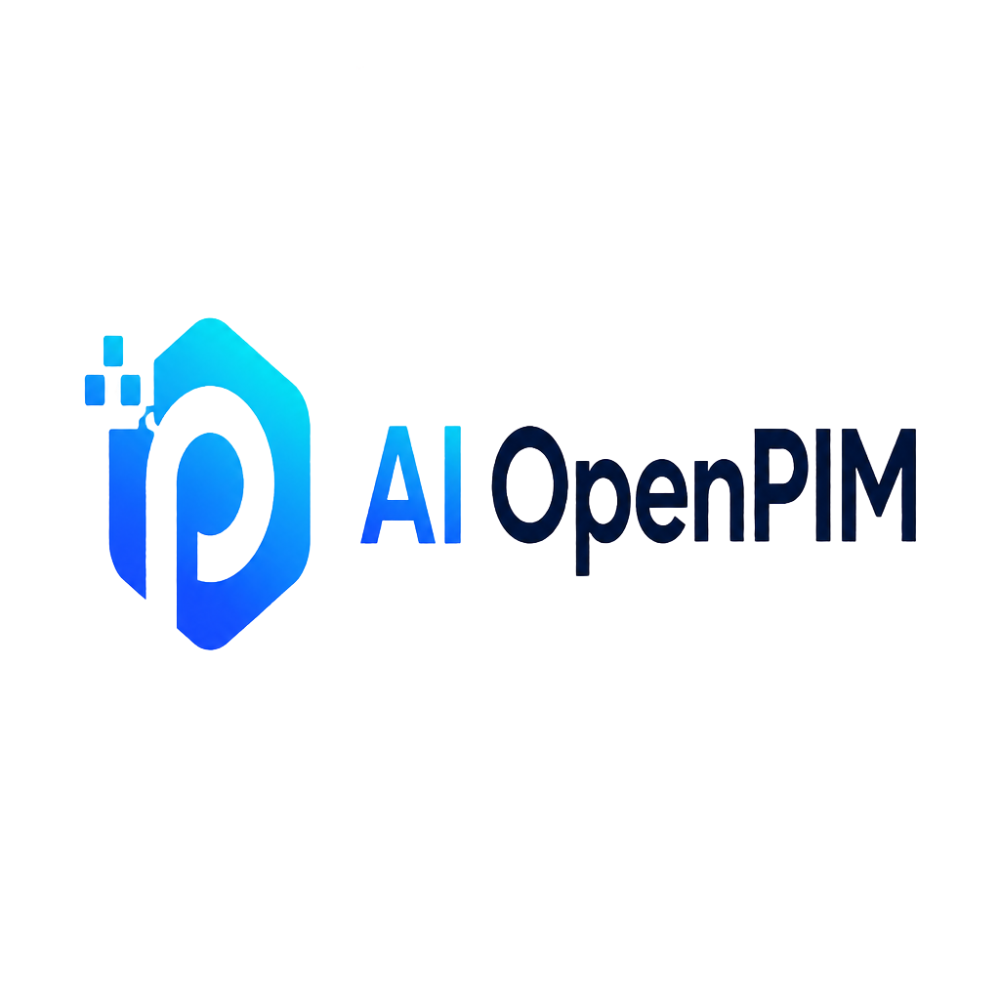
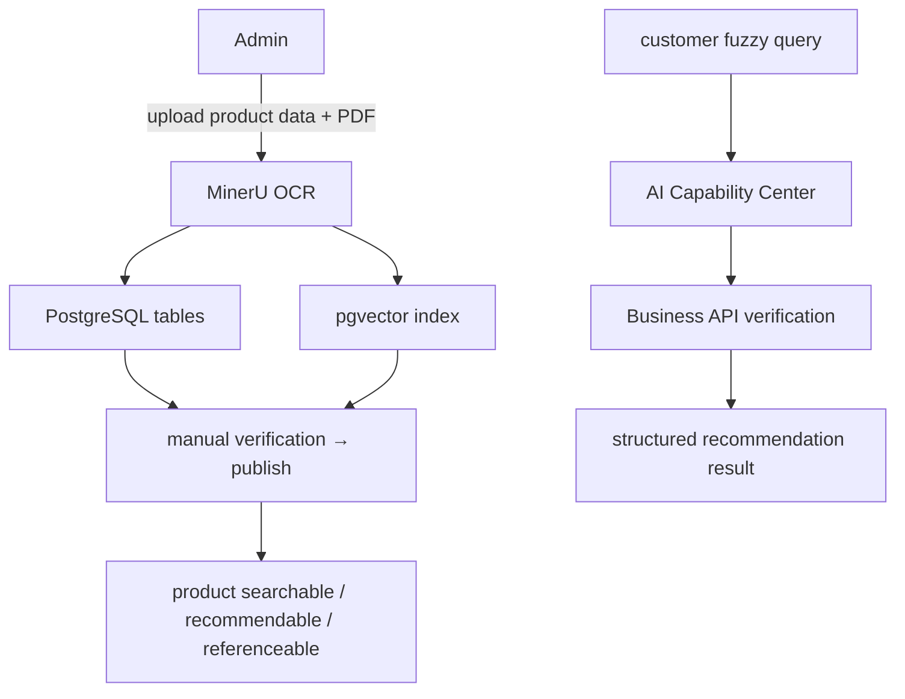
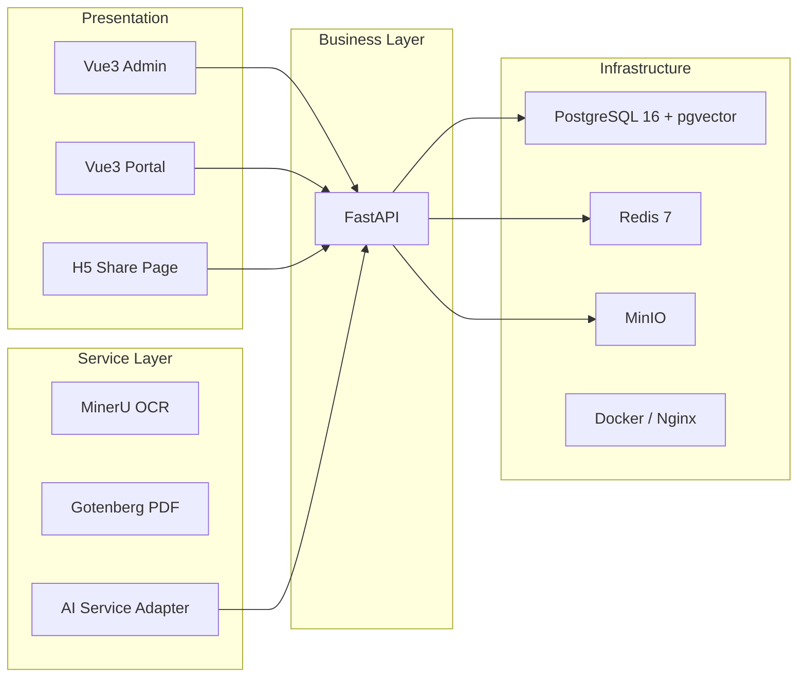

<!-- Language Switch -->
<p align="center">
  <a href="README.md">🇨🇳 中文</a> · <a href="README_EN.md">🇺🇸 English</a>
</p>

<!-- Logo -->
<p align="center">
  
</p>

<!-- Hero -->
<p align="center">
  <strong>AI-PIM OpenPIM</strong> — Open Source Product Information Management<br/>
  <sub>AI-powered · Structured Data · Media Assets · Proposals & Quotes · Secure Sharing · Knowledge Gateway</sub>
</p>

<p align="center">
  
  
  
  
  
  
  
</p>

<p align="center">
  <a href="#overview">Overview</a> ·
  <a href="#features">Features</a> ·
  <a href="#data-dashboard">Data</a> ·
  <a href="#architecture">Architecture</a> ·
  <a href="#quick-start">Quick Start</a> ·
  <a href="#docs">Docs</a>
</p>

---

> This README preserves the full code index, startup methods, data locations, and product information landing points of the current snapshot, making handover, troubleshooting, and reproduction easier.

## Overview

| Item | Status |
| --- | --- |
| Project root | `OpenPIM/` |
| Backend | `backend/`, FastAPI + SQLAlchemy + Alembic |
| Admin frontend | `frontend/`, Vue 3 + Vite + Element Plus + Pinia |
| AI Portal | `portal/`, independent AI conversation portal |
| Database | PostgreSQL 16 + pgvector |
| Cache | Redis 7 |
| Object storage | MinIO |
| Document conversion | Gotenberg 8 |
| OCR service | Independent service inside `docker/ocr/` container |
| AI default state | `AI_ADAPTER=openai`, `AI_CHAT_MODEL=gpt-4o-mini` |
| Knowledge Gateway | Enabled by default (`KNOWLEDGE_GATEWAY_ENABLED=1`) |
| Current release | **v1.9.1** (see [CHANGELOG.md](CHANGELOG.md)) |
| Migration head | `0017_operation_log_username` |
| Production entry | `http://127.0.0.1:888/` (Docker nginx `888:80`; portal / share `/share/{token}` / `/admin/` / `/api/v1/*`) |
| Admin entry | `http://127.0.0.1:888/admin/` (production nginx) or `http://127.0.0.1:5173/admin/` (demo server, public tunnel) |
| Environment health check | `bash scripts/where-am-i.sh` (**run first before any work**) |
| Real-machine ops guide | [README-OPS.md](README-OPS.md), `/home/AI-PIM/从启动到穿透.md` |
| Full migration / disaster recovery | [MIGRATION_BUNDLE.md](MIGRATION_BUNDLE.md) |
| Cloud production upgrade | [docs/云端更新包.md](docs/云端更新包.md) |
| Data volumes | [docs/数据卷与持久化存储.md](docs/数据卷与持久化存储.md) |
| MinIO operations | [docs/MinIO对象存储.md](docs/MinIO对象存储.md) |
| Main seed entry | `backend/app/scripts/seed_data.py` + `backend/alembic/versions/0004_seed_data.py` |
| Pilot product data | `backend/data/sunon_pilot_products.json` |

---

## Features

<div align="center">

| 🏷️ Products & Taxonomy | 📥 Bulk Import | 🖼️ Media Assets | 💬 AI Portal | 📊 Quality Dashboard |
|---|---|---|---|---|
| Category / Brand / Label / Supplier management | Excel / XLSM / ZIP bulk import | Product images, scene images, manuals, thumbnails | AI chat, knowledge retrieval, proposal polishing | Data completeness, audit, statistics board |

</div>

- Product, category, brand, supplier, tag management
- Product import/export and pilot data import (`import_sunon_products.py`: idempotent, verifiable, updatable)
- Excel / XLSM embedded images, ZIP image batches, product / scene image bulk import
- Import template download, row-isolated failures, image SHA-256 deduplication, MinIO upload
- Proposals, quotations, sharing pages with access control (`ShareToken` unified access credentials)
- Product images, scene images, manuals, media library (`derived/thumb/w{width}/...` thumbnail cache)
- Quality dashboard and data completeness auxiliary views (`quality_*.py` services)
- OCR, AI Capability Center, RAG infrastructure (`AIServiceAdapter` pluggable abstraction)

---

## Data Dashboard

> Key metrics of the current snapshot for quick project assessment.

| Metric | Value | Note |
|---|---|---|
| 📄 Code changes | **213 files** | `+29,419 / −1,303` lines |
| 🏷️ Release | **v1.9.1** | See [CHANGELOG.md](CHANGELOG.md) |
| 🗄️ Migration head | **`0017_operation_log_username`** | Alembic chain intact |
| 🏛️ Core tables | **23** | User / Product / Proposal / Quotation / Share / Audit (see `docs/02-系统架构与设计(HLD).md` §5) |
| 🏗️ Architecture layers | **4** | Presentation · Business · Service · Infrastructure |
| 🔧 Core business centers | **12** | Base / Data / Core entity / Sales / Analytics |
| 🧩 Product model fields | **20+** | `product_no`, `brand_id`, `supplier_id`, `category_id`, `face_price`, `cost_price`, `material`, `stock_status`, `status`, `description`, `specification`, `colors`, `data_source`, `completeness_status`, `tags`, `images`, `scene_images`, etc. |
| 🔐 Permission level | **Field-level** | Sales role masks `cost_price` / supplier chain; procurement sees full cost chain |
| 📦 Object storage bucket | **`ai-pim`** | MinIO default bucket, includes derived `derived/thumb/` objects |
| 🤖 AI adapter | **Pluggable** | `openai` default; switch to FastGPT / Dify / RagFlow with zero business-layer changes |

### Data Flow Overview



---

## Architecture

AI-PIM follows a standard **enterprise four-layer software architecture** with the core principle: **business logic is maintained by the database and Business API; AI handles understanding, generation, and recommendation only; all business flows through the Business API.**



> Full architecture, module dependencies, data flows (product upload / AI recommendation / proposal sharing), caching strategy, and interface specs: [docs/02-系统架构与设计(HLD).md](docs/02-系统架构与设计(HLD).md)

---

## Directory Structure

### Root

- `README.md`: current overview (CN)
- `README_EN.md`: current overview (EN)
- `docker-compose.yml`: production orchestration
- `docker-compose.dev.yml`: dev dependency orchestration
- `.env.example`: root environment variables template
- `.env`: current local dev environment
- `scripts/`: environment check (`where-am-i.sh`), frontend build (`build_frontends.sh`), demo server, backup, restore, health check, TLS generation, release gate scripts
- `docs/`: current requirements, architecture, database, API, deployment, test, storage docs
- `docs/过时/` (archived): historical design, planning, review, delivery, superseded deployment docs
- `AI-Docs/`: independent pluggable AI design, planning, and extension docs
- `backups/`: database backup and recovery practice files
- `docker/`: nginx, postgres init, OCR container infrastructure config

### Backend `backend/`

- `backend/app/main.py`: backend entry
- `backend/app/api/v1/`: all API routes
- `backend/app/core/`: config, DB, permissions, serialization, MinIO, rate limits
- `backend/app/models/`: ORM definitions (23 core tables: `Product`, `Category`, `Brand`, `Supplier`, `Tag`, `Proposal`, `Quotation`, `ShareToken`, etc.)
- `backend/app/schemas/`: Pydantic request/response models
- `backend/app/services/`: business services (export, RAG, OCR, quality analysis, parser, thumbnails `thumbnails.py`)
- `backend/app/adapters/`: AI adapter abstraction (`openai` default implementation)
- `backend/app/middleware/`: audit middleware
- `backend/app/scripts/`: init, seed, import scripts (`import_sunon_products.py`, `import_sunon_taxonomy.py`, `seed_data.py`, `init_admin.py`)
- `backend/alembic/`: migrations (current head `0017_operation_log_username`)
- `backend/tests/`: backend tests (`tests/unit/conftest.py` hard rule: only import leaf modules not linking `app.main` / `app.core.database`)

### Frontend `frontend/`

- `frontend/src/main.ts`: entry
- `frontend/src/router.ts`: routing & permission control
- `frontend/src/layouts/MainLayout.vue`: main layout
- `frontend/src/views/`: page-level views (`Products.vue`, `ProductDetail.vue`, `Import.vue`, `Manuals.vue`, `SceneImages.vue`, `MediaLibrary.vue`, `Quality.vue`)
- `frontend/src/components/`: reusable components (`ProductImageManager.vue`, `ProductSceneCarousel.vue`, `SceneImageSelector.vue`, `MediaPicker.vue`, `MediaUploader.vue`, `ProposalItemEditor.vue`)
- `frontend/src/api/`: API call wrappers
- `frontend/src/stores/`: Pinia state management
- `frontend/src/types/`: type definitions (`permissions.ts` field-level permission types)
- `frontend/src/utils/`: utilities (`beijingTime` timezone handling)
- `frontend/src/config/version.ts`: version display config
- `frontend/tests/`: component and e2e tests

---

## Quick Start

### 1. Development

Use `docker-compose.dev.yml` for base dependencies, then start backend, Portal, and Admin separately.

```bash
# 1) Start dependencies
docker compose -f docker-compose.dev.yml up -d

# 2) Start backend
cd backend
python -m venv venv
source venv/bin/activate
pip install -r requirements-dev.txt  # dev/test; production uses requirements.txt
uvicorn app.main:app --reload --host 0.0.0.0 --port 8000

# 3) Start Portal
cd portal
npm install
npm run dev

# 4) Start Admin
cd frontend
npm install
npm run dev
```

### Demo Mode (Tailscale Funnel)

For public demo, use the built-in demo server. **Port fixed at 5173, do not change** (`windows_demo_ports.ps1` defaults to it, and Funnel `3001` points to it):

```bash
export PATH="$HOME/.nvm/versions/node/v24.18.0/bin:$PATH"
PIM_DEMO_PORT=5173 PIM_DEMO_BACKEND=http://127.0.0.1:888 bash scripts/start_demo.sh
```

```bash
PIM_DEMO_PORT=5173 bash scripts/stop_demo.sh
```

`PIM_DEMO_BACKEND` **must** point to production nginx `:888`. Default `:8000` is dead on this machine (Windows process holds 8000); starting with default opens the page but **login spins forever**. Verify after start:

```bash
curl -s --noproxy '*' http://127.0.0.1:5173/__demo/health
```

`backendTarget` must be `http://127.0.0.1:888`.

Windows admin PowerShell port forwarding (default `-FrontendTargetPort 5173`, usually no parameter needed):

```powershell
Set-ExecutionPolicy -Scope Process Bypass
.\scripts\windows_demo_ports.ps1
```

Then start Funnel on Windows:

```powershell
tailscale funnel 3001
```

Use `3001` as the single public entry:

- `https://your-funnel-domain/`: AI Portal home
- `https://your-funnel-domain/chat`: AI chat
- `https://your-funnel-domain/admin/`: admin backend

Same-origin `/api` is forwarded by the demo server, so AI queries, portal, admin, product images, uploads, and sharing pages all work end-to-end.

If you also need to expose Docker nginx `888` separately for troubleshooting, `windows_demo_ports.ps1` now also adds `888 -> 888` Windows port forwarding:

```powershell
tailscale funnel 888
```

But for meeting demos, prefer `3001` to avoid splitting AI page, admin, and API across multiple public addresses.

Default dev ports:

- Portal: Vite default `5174`
- Admin: Vite default `5173` (**same port as demo server; they cannot run together**)
- Backend: `http://localhost:8000`
- API docs: `http://localhost:8000/docs`

> ⚠️ Confirm `DATABASE_URL` before starting local backend. **Never point to `localhost:5432/ai_pim`** — the production DB is inside the container with no published port; access it only via compose network hostname `postgres`. On 2026-07-31 there was a "all passwords wrong" incident because a native PostgreSQL empty DB with the same name existed locally. Run `bash scripts/where-am-i.sh` first.

### 2. Production / Containerized

> Real-machine details for this host (Windows 11 + Docker Desktop + WSL `OpenPIM`) are in [README-OPS.md](README-OPS.md) "This machine's truth" and `/home/AI-PIM/从启动到穿透.md`. Below is the generic flow.

```bash
# 1) Configure environment
cp .env.example .env
# Edit .env; set ADMIN_PASSWORD, JWT_SECRET, POSTGRES_PASSWORD, MINIO_ROOT_*

# 2) Build both frontends (do not use bare npm run build)
export PATH="$HOME/.nvm/versions/node/v24.18.0/bin:$PATH"
bash scripts/build_frontends.sh

# 3) Generate local TLS cert (local verification only; self-signed cert must be trusted manually)
./scripts/generate_dev_tls.sh

# 4) Start full stack
docker compose up -d
```

`build_frontends.sh` does two extra things that cannot be skipped: injects real version metadata (`VITE_APP_VERSION` / `BUILD_ID` / `GIT_COMMIT` / `BUILD_TIME`, otherwise the version page shows fake `dev` values), and merges `frontend/dist/assets` into `portal/dist/assets` (admin is built with `base '/'`; without this step admin JS/CSS returns 404 in production).

**Changing frontend requires rebuilding the nginx image**: `frontend/dist` / `portal/dist` are `COPY`ed into the image, not bind-mounted.

```bash
docker compose build nginx && docker compose up -d --no-deps nginx
```

Production compose runs automatically after backend container starts:

`Wait PostgreSQL ready -> alembic upgrade head -> admin init -> seed data -> uvicorn start`

So manual `alembic upgrade head` or `python -m app.scripts.seed_data` is not needed for normal deployment.

Note: "admin init" uses `.env` `ADMIN_PASSWORD` to recalculate hash and overwrite the DB admin password **on every backend container start**. Any admin password changed in the UI will be overwritten on next restart.

---

## Configuration

### Root environment variables

- `OpenPIM/.env`

For current local development snapshot, includes PostgreSQL, JWT, MinIO, AI config.

### Backend environment template

- `OpenPIM/backend/.env.example`
- `OpenPIM/backend/.env`

Backend config reading logic:

- `backend/app/core/config.py`

Reads `.env` from the `backend/` project root, independent of the working directory at startup.

---

## Data & Storage

### Database

Production `docker-compose.yml` uses named volumes:

- PostgreSQL: `richangpim_go_postgres_pg16_data_20260716`
- Redis: `richangpim_go_redis_data_20260716`
- MinIO: `richangpim_go_minio_data_20260716`

Service locations in `docker-compose.yml`:

- `postgres`: `postgres_pg16_data:/var/lib/postgresql/data`
- `redis`: `redis_data:/data`
- `minio`: `minio_data:/data`

Dev `docker-compose.dev.yml` uses project directory bind mounts:

- `./docker/volumes/postgres_dev`
- `./docker/volumes/minio_dev`

### Backup directory

- `./backups`

Production backend container mounts this read-only at `/data/backups` for health checks and capacity status.

### MinIO Object Storage

Default logical bucket:

- `MINIO_BUCKET=ai-pim`

Actual object keys depend on upload logic; common contents:

- Product images
- Scene images
- Manual / attachment PDFs
- Quotation-related files
- `derived/thumb/w{width}/{original key}.webp`: list thumbnail read-through cache (derived object; can be deleted anytime; rebuilt automatically)

List cover does not send original image; uses `GET /api/v1/files/{id}/content?w=<short side width>`: width whitelist `96 / 192 / 240 / 480 / 960`; outside whitelist returns 422 (no silent fallback to original image). Server implementation: `backend/app/services/thumbnails.py`; frontend width settings: `frontend/src/views/Products.vue` (table 192 / card 480); both sides must match. Original image path (without `w`) remains unchanged.

---

## Product Information Index

Product information in this PIM is not stored in a single file; it is distributed across models, APIs, pages, import scripts, and data files.

### 1. Product Data Model

- `backend/app/models/product.py`
- `backend/app/schemas/product.py`

Defines core fields:

- `product_no`
- `product_name`
- `brand_id`
- `supplier_id`
- `category_id`
- `face_price`
- `cost_price`
- `material`
- `stock_status`
- `status`
- `description`
- `specification`
- `colors`
- `data_source`
- `completeness_status`
- `tags`
- `images`
- `scene_images`

### 2. Product API

- `backend/app/api/v1/products.py`

Main entry for product-related interfaces:

- Product list & details
- Create, edit, delete, clone
- Import, export
- Main image & scene image management
- Quality dashboard & quality export

### 3. Product Import Data

- `backend/data/sunon_pilot_products.json`

Current pilot product JSON data; import script reads it.

- `backend/app/scripts/import_sunon_products.py`

Pilot import script: idempotent, verifiable, updates existing products.

- `backend/app/scripts/import_sunon_taxonomy.py`

Pilot taxonomy import script for category and series tag import.

### 4. Product Pages

- `frontend/src/views/Products.vue`
- `frontend/src/views/ProductDetail.vue`
- `frontend/src/views/Import.vue`
- `frontend/src/views/Manuals.vue`
- `frontend/src/views/SceneImages.vue`
- `frontend/src/views/MediaLibrary.vue`
- `frontend/src/views/Quality.vue`

### 5. Product Components

- `frontend/src/components/ProductImageManager.vue`
- `frontend/src/components/ProductSceneCarousel.vue`
- `frontend/src/components/SceneImageSelector.vue`
- `frontend/src/components/MediaPicker.vue`
- `frontend/src/components/MediaUploader.vue`
- `frontend/src/components/ProposalItemEditor.vue`

### 6. Product Frontend APIs

- `frontend/src/api/index.ts`
- `frontend/src/api/media.ts`

### 7. Product Permissions

- `frontend/src/types/permissions.ts`
- `backend/app/core/permissions.py`
- `backend/app/core/permission.py`
- `backend/app/scripts/seed_data.py`

---

## Initialization & Seed

### Database Migration

```bash
cd backend
alembic upgrade head
```

### Admin Initialization

```bash
cd backend
python -m app.scripts.init_admin
```

### RBAC Seed Data

```bash
cd backend
python -m app.scripts.seed_data
python -m app.scripts.seed_data --check
```

### Pilot Product Import

```bash
cd backend
python -m app.scripts.import_sunon_products data/sunon_pilot_products.json
```

Add `--check` to verify input without writing to DB.

---

## Testing

### Backend Tests

```bash
cd backend
PYTHONPATH=. pytest
```

When no reachable PostgreSQL test DB exists, pure unit tests continue; DB-dependent integration tests are skipped by design and should not fail.

`tests/unit` has a hard rule (`backend/tests/unit/conftest.py`): only import leaf modules not linking `app.main` / `app.core.database`. If it links, fix the application's import chain rather than dragging the entire app into the unit layer.

Host Python is 3.14, missing `pgvector` / `pytest-asyncio` / `pillow`, and PEP 668 prevents system install, so `pytest` collect fails — temporary venv recipe is in `README-OPS.md` troubleshooting "run `backend/tests` on host".

### Test Database

Reproducible local test DB baseline: PostgreSQL 16 + pgvector.

```bash
# Start dependencies; postgres creates ai_pim_test on first init
docker compose -f docker-compose.dev.yml up -d postgres redis minio

# Point tests to safe test DB
cd backend
TEST_DATABASE_URL=postgresql+asyncpg://pim:${POSTGRES_PASSWORD:-pim_password}@localhost:5432/ai_pim_test \
PYTHONPATH=. pytest
```

If test DB name does not contain `test`, you must also set `AI_PIM_TEST_DB_APPROVED=1`, or the test fixtures will refuse any table creation, drop, or migration actions.

### Frontend Tests

```bash
cd frontend
npm run test
npm run build
```

### P2 Assessment & Portal Gate

- Portal build: `cd portal && npm install && npm run build`
- Portal E2E: `scripts/p2/portal_e2e.sh`
- Knowledge Gateway regression: `scripts/p1/knowledge_gateway_eval.py`
- P2 RAG / security assessment: `scripts/p2/rag_eval.py`, `scripts/p2/security_eval.py`

These are P2 gate entries; `portal/` and `scripts/p2/*` must be executed after the corresponding feature lands, not replaced by README text.

### End-to-End & Checks

- `frontend/tests/e2e/`: frontend end-to-end tests
- `scripts/healthcheck.sh`: service health check
- `scripts/release_gate.sh`: release gate check

---

## Documentation

- `docs/00-项目概述.md`
- `docs/01-产品需求(PRD).md`
- `docs/02-系统架构与设计(HLD).md`
- `docs/03-数据库设计(ERD).md`
- `docs/04-接口规范(OpenAPI).md`
- `docs/05-业务流程(BPM).md`
- `docs/06-部署方案.md`
- `docs/07-开发规范.md`
- `docs/08-开发路线图.md`
- `docs/09-测试计划.md`
- `AI-Docs/README.md`: pluggable AI design & planning entry
- `docs/过时/README.md`: archived historical docs explanation
- `MIGRATION_BUNDLE.md`: full migration package creation & restore
- `README-OPS.md`: current machine operations runbook
- `RELEASE_GATE.md`: release gate

---

## Operating Rules

- `OCR_ADAPTER=none`: OCR disabled by default
- `AI_ADAPTER=none`: AI disabled by default
- `ADMIN_PASSWORD` must not be empty; otherwise backend fails closed and does not start
- Production should prefer environment variable injection; do not rely on `.env` committed to repo
- Product numbers must be unique on undeleted data; see `backend/app/models/product.py`

---

## License

Proprietary
