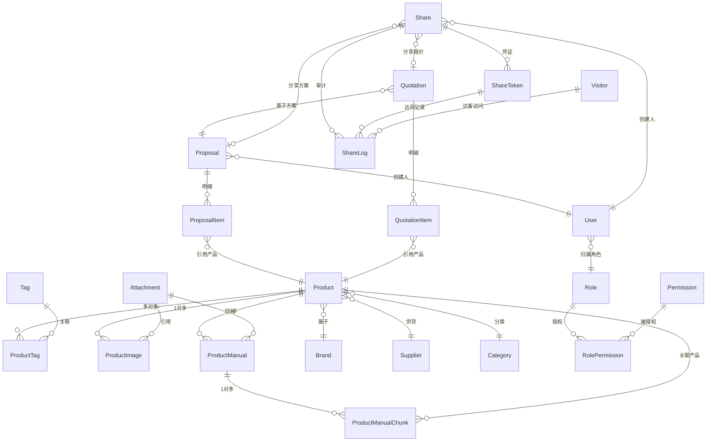

# 03 - 数据库设计（ERD）

> 本文档定义 AI-PIM 全部 24 张核心表的完整结构、建表 DDL、索引策略、触发器与 Alembic 迁移规范。
> 开发者可直接执行本文档 DDL 完成建库，或使用 Alembic 迁移脚本管理版本。

---

## 一、设计规约

### 1.1 主键规范

- 所有表统一采用 `id (UUID)` 作为主键
- **UUID v7** 具备时间有序性，利于 B-tree 索引性能，由应用层（Python ORM）生成
- DDL 中以 `uuid_generate_v4()` 作为兜底默认值，生产环境由应用层注入 v7

### 1.2 时间戳规范

所有表必须包含：

| 字段 | 类型 | 说明 |
| --- | --- | --- |
| `create_time` | `TIMESTAMPTZ` | 创建时间，默认 `now()` |
| `update_time` | `TIMESTAMPTZ` | 更新时间，触发器自动更新（见 5.1） |

### 1.3 软删除规范

所有业务表统一增加：

| 字段 | 类型 | 说明 |
| --- | --- | --- |
| `deleted_at` | `TIMESTAMPTZ` | 删除时间戳，NULL 表示未删除 |
| `is_deleted` | `BOOLEAN` | 删除标记，默认 `false` |

- 业务层禁止直接物理删除（`DELETE`）
- 物理删除仅用于极端数据清理场景
- 所有查询默认追加 `WHERE is_deleted = false`
- 日志类表（ShareLog / OperationLog / AIConversation）为追加写，不做软删除

### 1.4 命名规约

| 对象 | 规范 | 示例 |
| --- | --- | --- |
| 表名 | snake_case 单数 | `product`, `share_token` |
| 字段名 | snake_case | `product_no`, `create_time` |
| 外键字段 | `{关联表}_id` | `brand_id`, `creator_id` |
| 索引名 | `idx_{表}_{字段}` | `idx_product_status` |
| 唯一索引 | `uk_{表}_{字段}` | `uk_product_no` |

### 1.5 多租户预留

当前以单租户为主，后续 SaaS 化版本在主键之外增加 `tenant_id` 作为统一分区/索引维度。

---

## 二、数据表总览（24 张）

系统底座由 **24 张核心表**构成，按数据域划分。MVP 阶段全部建表，V1+ 按需扩展统计与分析表。

### 2.1 用户与权限域（4 张）

| 表名 | 说明 | 核心字段 |
| --- | --- | --- |
| `user` | 用户表 | id, username, password_hash, email, phone, status, role_id |
| `role` | 角色表 | id, role_name, role_code, description |
| `permission` | 权限表 | id, perm_code, perm_name, resource, action, type |
| `role_permission` | 角色权限关联表 | id, role_id, permission_id |

### 2.2 产品核心域（6 张）

| 表名 | 说明 | 核心字段 |
| --- | --- | --- |
| `product` | 产品主表 | id, product_no, product_name, brand_id, supplier_id, category_id, face_price, cost_price, material, stock_status, status, vector |
| `category` | 分类树形表 | id, parent_id, level, category_name, sort |
| `tag` | 标签表 | id, tag_name, tag_type |
| `product_tag` | 产品标签中间表 | id, product_id, tag_id |
| `brand` | 品牌表 | id, brand_name, logo_url, description |
| `supplier` | 供应商表 | id, supplier_name, contact, phone, cooperation_status |

### 2.3 资产与存储域（4 张）

| 表名 | 说明 | 核心字段 |
| --- | --- | --- |
| `attachment` | 文件主表 | id, file_name, file_url, file_type, file_size, storage_type, oss_key |
| `product_image` | 产品图片表 | id, product_id, attachment_id, sort, is_cover |
| `product_manual` | 说明书及文档表 | id, product_id, attachment_id, doc_type, parsed_content |
| `product_manual_chunk` | RAG 文档切片表 | id, product_manual_id, product_id, chunk_index, chunk_text, embedding |

### 2.4 销售交易域（4 张）

| 表名 | 说明 | 核心字段 |
| --- | --- | --- |
| `proposal` | 方案主表 | id, proposal_no, proposal_name, creator_id, customer_name, status, ai_polished, ai_polish_content, ai_polish_at, ai_polish_model |
| `proposal_item` | 方案明细表 | id, proposal_id, product_id, quantity, sort, remark |
| `quotation` | 报价单表 | id, quotation_no, proposal_id, total_amount, tax_rate, discount, status |
| `quotation_item` | 报价单明细表 | id, quotation_id, product_id, quantity, unit_price, tax_rate, subtotal |

### 2.5 流转与审计域（6 张）

| 表名 | 说明 | 核心字段 |
| --- | --- | --- |
| `share` | 对外分享配置表 | id, share_type, target_id, creator_id, status |
| `share_token` | 分享凭证表 | id, share_id, token, password, expire_time, max_access_count, current_access_count, status |
| `share_log` | 分享访问审计表 | id, share_token_id, visitor_id, visitor_ip, visitor_ua, device_fingerprint, openid, access_time, access_result |
| `operation_log` | 系统操作日志表 | id, user_id, module, action, target_id, request_body, response_code, ip, operate_time |
| `ai_conversation` | AI 交互对话上下文表 | id, session_id, user_id, question, answer, sources, tool_calls, create_time |
| `visitor` | 访客表 | id, fingerprint, openid, unionid, nickname, avatar_url, first_seen_time, last_seen_time |

---

## 三、完整建表 DDL

> 以下 DDL 可直接在 PostgreSQL 16 + pgvector 环境执行。按域分组，建议按此顺序建表以满足外键依赖。

### 3.0 扩展与基础函数

```sql
-- pgvector 向量扩展
CREATE EXTENSION IF NOT EXISTS vector;

-- UUID 生成扩展（PG16 无原生 UUIDv7，由应用层生成 v7，此处兜底）
CREATE EXTENSION IF NOT EXISTS "uuid-ossp";

-- update_time 自动更新触发器函数
CREATE OR REPLACE FUNCTION update_updated_at_column()
RETURNS TRIGGER AS $$
BEGIN
    NEW.update_time = now();
    RETURN NEW;
END;
$$ LANGUAGE plpgsql;
```

### 3.1 用户与权限域

```sql
-- 角色表（先建，user 依赖它）
CREATE TABLE role (
    id              UUID PRIMARY KEY DEFAULT uuid_generate_v4(),
    role_name       VARCHAR(64)  NOT NULL,
    role_code       VARCHAR(32)  NOT NULL,
    description     VARCHAR(255),
    create_time     TIMESTAMPTZ  NOT NULL DEFAULT now(),
    update_time     TIMESTAMPTZ  NOT NULL DEFAULT now(),
    deleted_at      TIMESTAMPTZ,
    is_deleted      BOOLEAN      NOT NULL DEFAULT false
);
CREATE UNIQUE INDEX uk_role_code ON role (role_code) WHERE is_deleted = false;

CREATE TRIGGER trg_role_update BEFORE UPDATE ON role
    FOR EACH ROW EXECUTE FUNCTION update_updated_at_column();

-- 权限表
CREATE TABLE permission (
    id              UUID PRIMARY KEY DEFAULT uuid_generate_v4(),
    perm_code       VARCHAR(64)  NOT NULL,
    perm_name       VARCHAR(64)  NOT NULL,
    resource        VARCHAR(64)  NOT NULL,
    action          VARCHAR(32)  NOT NULL,
    type            VARCHAR(20)  NOT NULL,
    create_time     TIMESTAMPTZ  NOT NULL DEFAULT now(),
    update_time     TIMESTAMPTZ  NOT NULL DEFAULT now(),
    deleted_at      TIMESTAMPTZ,
    is_deleted      BOOLEAN      NOT NULL DEFAULT false,
    CONSTRAINT chk_perm_type CHECK (type IN ('menu', 'button', 'api', 'field')),
    CONSTRAINT chk_perm_action CHECK (action IN ('read', 'write', 'delete', 'export', 'share'))
);
CREATE UNIQUE INDEX uk_perm_code ON permission (perm_code) WHERE is_deleted = false;

CREATE TRIGGER trg_permission_update BEFORE UPDATE ON permission
    FOR EACH ROW EXECUTE FUNCTION update_updated_at_column();

-- 角色权限关联表
CREATE TABLE role_permission (
    id              UUID PRIMARY KEY DEFAULT uuid_generate_v4(),
    role_id         UUID         NOT NULL,
    permission_id   UUID         NOT NULL,
    create_time     TIMESTAMPTZ  NOT NULL DEFAULT now(),
    update_time     TIMESTAMPTZ  NOT NULL DEFAULT now(),
    deleted_at      TIMESTAMPTZ,
    is_deleted      BOOLEAN      NOT NULL DEFAULT false,
    CONSTRAINT fk_rp_role       FOREIGN KEY (role_id)       REFERENCES role(id),
    CONSTRAINT fk_rp_permission FOREIGN KEY (permission_id) REFERENCES permission(id)
);
CREATE UNIQUE INDEX uk_rp_role_perm ON role_permission (role_id, permission_id) WHERE is_deleted = false;

CREATE TRIGGER trg_role_permission_update BEFORE UPDATE ON role_permission
    FOR EACH ROW EXECUTE FUNCTION update_updated_at_column();

-- 用户表
CREATE TABLE "user" (
    id              UUID PRIMARY KEY DEFAULT uuid_generate_v4(),
    username        VARCHAR(64)  NOT NULL,
    password_hash   VARCHAR(255) NOT NULL,
    email           VARCHAR(128),
    phone           VARCHAR(20),
    status          VARCHAR(20)  NOT NULL DEFAULT 'active',
    role_id         UUID         NOT NULL,
    last_login_time TIMESTAMPTZ,
    create_time     TIMESTAMPTZ  NOT NULL DEFAULT now(),
    update_time     TIMESTAMPTZ  NOT NULL DEFAULT now(),
    deleted_at      TIMESTAMPTZ,
    is_deleted      BOOLEAN      NOT NULL DEFAULT false,
    CONSTRAINT chk_user_status CHECK (status IN ('active', 'disabled')),
    CONSTRAINT fk_user_role    FOREIGN KEY (role_id) REFERENCES role(id)
);
CREATE UNIQUE INDEX uk_user_username ON "user" (username) WHERE is_deleted = false;
CREATE INDEX idx_user_role ON "user" (role_id) WHERE is_deleted = false;

CREATE TRIGGER trg_user_update BEFORE UPDATE ON "user"
    FOR EACH ROW EXECUTE FUNCTION update_updated_at_column();
```

### 3.2 产品核心域

```sql
-- 分类表（树形，先建）
CREATE TABLE category (
    id              UUID PRIMARY KEY DEFAULT uuid_generate_v4(),
    parent_id       UUID,
    level           INT          NOT NULL,
    category_name   VARCHAR(128) NOT NULL,
    sort            INT          NOT NULL DEFAULT 0,
    create_time     TIMESTAMPTZ  NOT NULL DEFAULT now(),
    update_time     TIMESTAMPTZ  NOT NULL DEFAULT now(),
    deleted_at      TIMESTAMPTZ,
    is_deleted      BOOLEAN      NOT NULL DEFAULT false,
    CONSTRAINT fk_category_parent FOREIGN KEY (parent_id) REFERENCES category(id),
    CONSTRAINT chk_category_level CHECK (level BETWEEN 1 AND 5)
);
CREATE INDEX idx_category_parent ON category (parent_id) WHERE is_deleted = false;

CREATE TRIGGER trg_category_update BEFORE UPDATE ON category
    FOR EACH ROW EXECUTE FUNCTION update_updated_at_column();

-- 品牌表
CREATE TABLE brand (
    id              UUID PRIMARY KEY DEFAULT uuid_generate_v4(),
    brand_name      VARCHAR(128) NOT NULL,
    logo_url        VARCHAR(512),
    description     TEXT,
    create_time     TIMESTAMPTZ  NOT NULL DEFAULT now(),
    update_time     TIMESTAMPTZ  NOT NULL DEFAULT now(),
    deleted_at      TIMESTAMPTZ,
    is_deleted      BOOLEAN      NOT NULL DEFAULT false
);
CREATE UNIQUE INDEX uk_brand_name ON brand (brand_name) WHERE is_deleted = false;

CREATE TRIGGER trg_brand_update BEFORE UPDATE ON brand
    FOR EACH ROW EXECUTE FUNCTION update_updated_at_column();

-- 供应商表
CREATE TABLE supplier (
    id                  UUID PRIMARY KEY DEFAULT uuid_generate_v4(),
    supplier_name       VARCHAR(128) NOT NULL,
    contact             VARCHAR(64),
    phone               VARCHAR(20),
    cooperation_status  VARCHAR(20)  NOT NULL DEFAULT 'active',
    create_time         TIMESTAMPTZ  NOT NULL DEFAULT now(),
    update_time         TIMESTAMPTZ  NOT NULL DEFAULT now(),
    deleted_at          TIMESTAMPTZ,
    is_deleted          BOOLEAN      NOT NULL DEFAULT false,
    CONSTRAINT chk_supplier_status CHECK (cooperation_status IN ('active', 'suspended', 'terminated'))
);
CREATE UNIQUE INDEX uk_supplier_name ON supplier (supplier_name) WHERE is_deleted = false;

CREATE TRIGGER trg_supplier_update BEFORE UPDATE ON supplier
    FOR EACH ROW EXECUTE FUNCTION update_updated_at_column();

-- 标签表
CREATE TABLE tag (
    id              UUID PRIMARY KEY DEFAULT uuid_generate_v4(),
    tag_name        VARCHAR(64)  NOT NULL,
    tag_type        VARCHAR(32),
    create_time     TIMESTAMPTZ  NOT NULL DEFAULT now(),
    update_time     TIMESTAMPTZ  NOT NULL DEFAULT now(),
    deleted_at      TIMESTAMPTZ,
    is_deleted      BOOLEAN      NOT NULL DEFAULT false
);
CREATE UNIQUE INDEX uk_tag_name_type ON tag (tag_name, tag_type) WHERE is_deleted = false;

CREATE TRIGGER trg_tag_update BEFORE UPDATE ON tag
    FOR EACH ROW EXECUTE FUNCTION update_updated_at_column();

-- 产品主表
CREATE TABLE product (
    id              UUID PRIMARY KEY DEFAULT uuid_generate_v4(),
    product_no      VARCHAR(64)     NOT NULL,
    product_name    VARCHAR(255)    NOT NULL,
    brand_id        UUID            NOT NULL,
    supplier_id     UUID            NOT NULL,
    category_id     UUID            NOT NULL,
    face_price      DECIMAL(12,2)   NOT NULL,
    cost_price      DECIMAL(12,2),
    material        VARCHAR(128),
    stock_status    VARCHAR(20)     NOT NULL DEFAULT 'in_stock',
    status          VARCHAR(20)     NOT NULL DEFAULT 'draft',
    vector          vector(1536),    -- 向量字段，1536 对应 OpenAI text-embedding-ada-002；切换 Embedding 模型需 ALTER 字段长度
    create_time     TIMESTAMPTZ     NOT NULL DEFAULT now(),
    update_time     TIMESTAMPTZ     NOT NULL DEFAULT now(),
    deleted_at      TIMESTAMPTZ,
    is_deleted      BOOLEAN         NOT NULL DEFAULT false,
    CONSTRAINT chk_product_stock  CHECK (stock_status IN ('in_stock', 'out_of_stock', 'preorder')),
    CONSTRAINT chk_product_status CHECK (status IN ('active', 'inactive', 'draft')),
    CONSTRAINT chk_product_price  CHECK (face_price >= 0),
    CONSTRAINT fk_product_brand    FOREIGN KEY (brand_id)    REFERENCES brand(id),
    CONSTRAINT fk_product_supplier FOREIGN KEY (supplier_id) REFERENCES supplier(id),
    CONSTRAINT fk_product_category FOREIGN KEY (category_id) REFERENCES category(id)
);
CREATE UNIQUE INDEX uk_product_no ON product (product_no) WHERE is_deleted = false;
CREATE INDEX idx_product_status     ON product (status)      WHERE is_deleted = false;
CREATE INDEX idx_product_category   ON product (category_id)  WHERE is_deleted = false;
CREATE INDEX idx_product_brand_supp ON product (brand_id, supplier_id) WHERE is_deleted = false;
CREATE INDEX idx_product_vector     ON product USING hnsw (vector vector_cosine_ops) WHERE vector IS NOT NULL;

CREATE TRIGGER trg_product_update BEFORE UPDATE ON product
    FOR EACH ROW EXECUTE FUNCTION update_updated_at_column();

-- 产品标签中间表
CREATE TABLE product_tag (
    id              UUID PRIMARY KEY DEFAULT uuid_generate_v4(),
    product_id      UUID         NOT NULL,
    tag_id          UUID         NOT NULL,
    create_time     TIMESTAMPTZ  NOT NULL DEFAULT now(),
    CONSTRAINT fk_pt_product FOREIGN KEY (product_id) REFERENCES product(id) ON DELETE CASCADE,
    CONSTRAINT fk_pt_tag     FOREIGN KEY (tag_id)     REFERENCES tag(id)
);
CREATE UNIQUE INDEX uk_pt_product_tag ON product_tag (product_id, tag_id);
CREATE INDEX idx_pt_tag ON product_tag (tag_id);
```

### 3.3 资产与存储域

```sql
-- 文件主表
CREATE TABLE attachment (
    id              UUID PRIMARY KEY DEFAULT uuid_generate_v4(),
    file_name       VARCHAR(255) NOT NULL,
    file_url        VARCHAR(512) NOT NULL,
    file_type       VARCHAR(32)  NOT NULL,
    file_size       BIGINT       NOT NULL,
    storage_type    VARCHAR(20)  NOT NULL DEFAULT 'minio',
    oss_key         VARCHAR(512) NOT NULL,
    create_time     TIMESTAMPTZ  NOT NULL DEFAULT now(),
    update_time     TIMESTAMPTZ  NOT NULL DEFAULT now(),
    deleted_at      TIMESTAMPTZ,
    is_deleted      BOOLEAN      NOT NULL DEFAULT false,
    CONSTRAINT chk_attach_type CHECK (file_type IN ('image', 'video', 'pdf', 'doc', 'other')),
    CONSTRAINT chk_attach_storage CHECK (storage_type IN ('minio', 'local'))
);
CREATE INDEX idx_attach_oss_key ON attachment (oss_key);

CREATE TRIGGER trg_attachment_update BEFORE UPDATE ON attachment
    FOR EACH ROW EXECUTE FUNCTION update_updated_at_column();

-- 产品图片表
CREATE TABLE product_image (
    id              UUID PRIMARY KEY DEFAULT uuid_generate_v4(),
    product_id      UUID         NOT NULL,
    attachment_id   UUID         NOT NULL,
    sort            INT          NOT NULL DEFAULT 0,
    is_cover        BOOLEAN      NOT NULL DEFAULT false,
    create_time     TIMESTAMPTZ  NOT NULL DEFAULT now(),
    update_time     TIMESTAMPTZ  NOT NULL DEFAULT now(),
    deleted_at      TIMESTAMPTZ,
    is_deleted      BOOLEAN      NOT NULL DEFAULT false,
    CONSTRAINT fk_pi_product   FOREIGN KEY (product_id)   REFERENCES product(id),
    CONSTRAINT fk_pi_attachment FOREIGN KEY (attachment_id) REFERENCES attachment(id)
);
CREATE INDEX idx_pi_product ON product_image (product_id) WHERE is_deleted = false;
CREATE INDEX idx_pi_attachment ON product_image (attachment_id) WHERE is_deleted = false;

CREATE TRIGGER trg_product_image_update BEFORE UPDATE ON product_image
    FOR EACH ROW EXECUTE FUNCTION update_updated_at_column();

-- 说明书及文档表
CREATE TABLE product_manual (
    id              UUID PRIMARY KEY DEFAULT uuid_generate_v4(),
    product_id      UUID         NOT NULL,
    attachment_id   UUID         NOT NULL,
    doc_type        VARCHAR(32)  NOT NULL,
    parsed_content  TEXT,
    create_time     TIMESTAMPTZ  NOT NULL DEFAULT now(),
    update_time     TIMESTAMPTZ  NOT NULL DEFAULT now(),
    deleted_at      TIMESTAMPTZ,
    is_deleted      BOOLEAN      NOT NULL DEFAULT false,
    CONSTRAINT chk_manual_type CHECK (doc_type IN ('manual', 'spec', 'datasheet', 'certificate', 'other')),
    CONSTRAINT fk_pm_product   FOREIGN KEY (product_id)   REFERENCES product(id),
    CONSTRAINT fk_pm_attachment FOREIGN KEY (attachment_id) REFERENCES attachment(id)
);
CREATE INDEX idx_pm_product ON product_manual (product_id) WHERE is_deleted = false;
CREATE INDEX idx_pm_attachment ON product_manual (attachment_id) WHERE is_deleted = false;

CREATE TRIGGER trg_product_manual_update BEFORE UPDATE ON product_manual
    FOR EACH ROW EXECUTE FUNCTION update_updated_at_column();

-- RAG 文档切片表（V1 新增）
CREATE TABLE product_manual_chunk (
    id              UUID PRIMARY KEY DEFAULT uuid_generate_v4(),
    product_manual_id   UUID         NOT NULL,
    product_id          UUID         NOT NULL,
    chunk_index         INT          NOT NULL,
    chunk_text          TEXT         NOT NULL,
    chunk_tokens        INT          DEFAULT 0,
    embedding           vector(1536),
    create_time         TIMESTAMPTZ  NOT NULL DEFAULT now(),
    deleted_at          TIMESTAMPTZ,
    is_deleted          BOOLEAN      NOT NULL DEFAULT false,
    CONSTRAINT fk_pmc_manual FOREIGN KEY (product_manual_id) REFERENCES product_manual(id) ON DELETE CASCADE,
    CONSTRAINT fk_pmc_product FOREIGN KEY (product_id) REFERENCES product(id)
);
CREATE INDEX idx_pmc_manual ON product_manual_chunk (product_manual_id) WHERE is_deleted = false;
CREATE INDEX idx_pmc_product ON product_manual_chunk (product_id) WHERE is_deleted = false;
CREATE INDEX idx_pmc_embedding ON product_manual_chunk USING hnsw (embedding vector_cosine_ops) WHERE embedding IS NOT NULL;

CREATE TRIGGER trg_product_manual_chunk_update BEFORE UPDATE ON product_manual_chunk
    FOR EACH ROW EXECUTE FUNCTION update_updated_at_column();
```

### 3.4 销售交易域

```sql
-- 方案主表
CREATE TABLE proposal (
    id              UUID PRIMARY KEY DEFAULT uuid_generate_v4(),
    proposal_no     VARCHAR(64)  NOT NULL,
    proposal_name   VARCHAR(255) NOT NULL,
    creator_id      UUID         NOT NULL,
    customer_name   VARCHAR(128),
    status          VARCHAR(20)  NOT NULL DEFAULT 'draft',
    ai_polished     BOOLEAN      NOT NULL DEFAULT false,
    ai_polish_content TEXT,                    -- LLM 输出的 JSON 结构文本，由 D3 polish service 写入
    ai_polish_at    TIMESTAMPTZ,               -- 由 D3 polish service 写入
    ai_polish_model VARCHAR(64),               -- 由 D3 polish service 写入
    total_face_value DECIMAL(14,2) NOT NULL DEFAULT 0,
    create_time     TIMESTAMPTZ  NOT NULL DEFAULT now(),
    update_time     TIMESTAMPTZ  NOT NULL DEFAULT now(),
    deleted_at      TIMESTAMPTZ,
    is_deleted      BOOLEAN      NOT NULL DEFAULT false,
    CONSTRAINT chk_proposal_status CHECK (status IN ('draft', 'confirmed', 'archived')),
    CONSTRAINT chk_proposal_face_value CHECK (total_face_value >= 0),
    CONSTRAINT fk_proposal_creator  FOREIGN KEY (creator_id) REFERENCES "user"(id)
);
CREATE UNIQUE INDEX uk_proposal_no ON proposal (proposal_no) WHERE is_deleted = false;
CREATE INDEX idx_proposal_creator ON proposal (creator_id) WHERE is_deleted = false;

CREATE TRIGGER trg_proposal_update BEFORE UPDATE ON proposal
    FOR EACH ROW EXECUTE FUNCTION update_updated_at_column();

-- 方案明细表
CREATE TABLE proposal_item (
    id              UUID PRIMARY KEY DEFAULT uuid_generate_v4(),
    proposal_id     UUID         NOT NULL,
    product_id      UUID         NOT NULL,
    quantity        INT          NOT NULL DEFAULT 1,
    sort            INT          NOT NULL DEFAULT 0,
    remark          TEXT,
    create_time     TIMESTAMPTZ  NOT NULL DEFAULT now(),
    update_time     TIMESTAMPTZ  NOT NULL DEFAULT now(),
    deleted_at      TIMESTAMPTZ,
    is_deleted      BOOLEAN      NOT NULL DEFAULT false,
    CONSTRAINT chk_pi_qty CHECK (quantity > 0),
    CONSTRAINT fk_pitem_proposal FOREIGN KEY (proposal_id) REFERENCES proposal(id) ON DELETE CASCADE,
    CONSTRAINT fk_pitem_product  FOREIGN KEY (product_id)  REFERENCES product(id)
);
CREATE INDEX idx_pitem_proposal ON proposal_item (proposal_id) WHERE is_deleted = false;
CREATE INDEX idx_pitem_product ON proposal_item (product_id) WHERE is_deleted = false;

CREATE TRIGGER trg_proposal_item_update BEFORE UPDATE ON proposal_item
    FOR EACH ROW EXECUTE FUNCTION update_updated_at_column();

-- 报价单表
CREATE TABLE quotation (
    id              UUID PRIMARY KEY DEFAULT uuid_generate_v4(),
    quotation_no    VARCHAR(64)     NOT NULL,
    proposal_id     UUID            NOT NULL,
    creator_id      UUID            NOT NULL,
    valid_until     TIMESTAMPTZ,
    total_amount    DECIMAL(14,2)   NOT NULL DEFAULT 0,
    tax_rate        DECIMAL(5,4)    NOT NULL DEFAULT 0.13,
    discount        DECIMAL(5,4)    NOT NULL DEFAULT 1.0,
    status          VARCHAR(20)     NOT NULL DEFAULT 'draft',
    create_time     TIMESTAMPTZ     NOT NULL DEFAULT now(),
    update_time     TIMESTAMPTZ     NOT NULL DEFAULT now(),
    deleted_at      TIMESTAMPTZ,
    is_deleted      BOOLEAN         NOT NULL DEFAULT false,
    CONSTRAINT chk_quotation_status CHECK (status IN ('draft', 'confirmed', 'expired')),
    CONSTRAINT chk_quotation_tax    CHECK (tax_rate BETWEEN 0 AND 1),
    CONSTRAINT chk_quotation_disc   CHECK (discount BETWEEN 0 AND 1),
    CONSTRAINT fk_quotation_proposal FOREIGN KEY (proposal_id) REFERENCES proposal(id),
    CONSTRAINT fk_quotation_creator  FOREIGN KEY (creator_id)  REFERENCES "user"(id)
);
CREATE UNIQUE INDEX uk_quotation_no ON quotation (quotation_no) WHERE is_deleted = false;
CREATE INDEX idx_quotation_creator ON quotation (creator_id) WHERE is_deleted = false;

CREATE TRIGGER trg_quotation_update BEFORE UPDATE ON quotation
    FOR EACH ROW EXECUTE FUNCTION update_updated_at_column();

-- 报价单明细表
CREATE TABLE quotation_item (
    id              UUID PRIMARY KEY DEFAULT uuid_generate_v4(),
    quotation_id    UUID            NOT NULL,
    product_id      UUID            NOT NULL,
    quantity        INT             NOT NULL DEFAULT 1,
    unit_price      DECIMAL(12,2)   NOT NULL,
    tax_rate        DECIMAL(5,4)    NOT NULL DEFAULT 0.13,
    subtotal        DECIMAL(14,2)   NOT NULL,
    create_time     TIMESTAMPTZ     NOT NULL DEFAULT now(),
    update_time     TIMESTAMPTZ     NOT NULL DEFAULT now(),
    deleted_at      TIMESTAMPTZ,
    is_deleted      BOOLEAN         NOT NULL DEFAULT false,
    CONSTRAINT chk_qi_qty   CHECK (quantity > 0),
    CONSTRAINT chk_qi_price CHECK (unit_price >= 0),
    CONSTRAINT fk_qitem_quotation FOREIGN KEY (quotation_id) REFERENCES quotation(id) ON DELETE CASCADE,
    CONSTRAINT fk_qitem_product   FOREIGN KEY (product_id)   REFERENCES product(id)
);
CREATE INDEX idx_qitem_quotation ON quotation_item (quotation_id) WHERE is_deleted = false;
CREATE INDEX idx_qitem_product ON quotation_item (product_id) WHERE is_deleted = false;

CREATE TRIGGER trg_quotation_item_update BEFORE UPDATE ON quotation_item
    FOR EACH ROW EXECUTE FUNCTION update_updated_at_column();
```

### 3.5 流转与审计域

```sql
-- 访客表（先建，share_log 外键依赖）
CREATE TABLE visitor (
    id              UUID PRIMARY KEY DEFAULT uuid_generate_v4(),
    fingerprint     VARCHAR(128),
    openid          VARCHAR(64),
    unionid         VARCHAR(64),
    nickname        VARCHAR(128),
    avatar_url      VARCHAR(512),
    first_seen_time TIMESTAMPTZ  NOT NULL DEFAULT now(),
    last_seen_time  TIMESTAMPTZ  NOT NULL DEFAULT now(),
    create_time     TIMESTAMPTZ  NOT NULL DEFAULT now(),
    update_time     TIMESTAMPTZ  NOT NULL DEFAULT now()
);
CREATE UNIQUE INDEX uk_visitor_openid ON visitor (openid) WHERE openid IS NOT NULL;
CREATE INDEX idx_visitor_fingerprint ON visitor (fingerprint);

CREATE TRIGGER trg_visitor_update BEFORE UPDATE ON visitor
    FOR EACH ROW EXECUTE FUNCTION update_updated_at_column();

-- 分享配置表
CREATE TABLE share (
    id              UUID PRIMARY KEY DEFAULT uuid_generate_v4(),
    share_type      VARCHAR(20)  NOT NULL,
    target_id       UUID         NOT NULL,
    creator_id      UUID         NOT NULL,
    status          VARCHAR(20)  NOT NULL DEFAULT 'active',
    create_time     TIMESTAMPTZ  NOT NULL DEFAULT now(),
    update_time     TIMESTAMPTZ  NOT NULL DEFAULT now(),
    deleted_at      TIMESTAMPTZ,
    is_deleted      BOOLEAN      NOT NULL DEFAULT false,
    CONSTRAINT chk_share_type   CHECK (share_type IN ('proposal', 'quotation')),
    CONSTRAINT chk_share_status CHECK (status IN ('active', 'disabled')),
    CONSTRAINT fk_share_creator FOREIGN KEY (creator_id) REFERENCES "user"(id)
);
CREATE INDEX idx_share_target ON share (share_type, target_id) WHERE is_deleted = false;

CREATE TRIGGER trg_share_update BEFORE UPDATE ON share
    FOR EACH ROW EXECUTE FUNCTION update_updated_at_column();

-- 分享凭证表
CREATE TABLE share_token (
    id                  UUID PRIMARY KEY DEFAULT uuid_generate_v4(),
    share_id            UUID         NOT NULL,
    token               VARCHAR(64)  NOT NULL,
    password            VARCHAR(255),
    expire_time         TIMESTAMPTZ,
    max_access_count    INT,
    current_access_count INT         NOT NULL DEFAULT 0,
    status              VARCHAR(20)  NOT NULL DEFAULT 'active',
    create_time         TIMESTAMPTZ  NOT NULL DEFAULT now(),
    update_time         TIMESTAMPTZ  NOT NULL DEFAULT now(),
    deleted_at          TIMESTAMPTZ,
    is_deleted          BOOLEAN      NOT NULL DEFAULT false,
    CONSTRAINT chk_st_status CHECK (status IN ('active', 'expired', 'disabled')),
    CONSTRAINT fk_st_share  FOREIGN KEY (share_id) REFERENCES share(id)
);
CREATE UNIQUE INDEX uk_share_token ON share_token (token) WHERE is_deleted = false;
CREATE INDEX idx_st_expire ON share_token (expire_time) WHERE status = 'active';
CREATE INDEX idx_st_share ON share_token (share_id) WHERE is_deleted = false;

CREATE TRIGGER trg_share_token_update BEFORE UPDATE ON share_token
    FOR EACH ROW EXECUTE FUNCTION update_updated_at_column();

-- 分享访问审计表（追加写，不做软删除）
CREATE TABLE share_log (
    id                  UUID PRIMARY KEY DEFAULT uuid_generate_v4(),
    share_token_id      UUID         NOT NULL,
    visitor_id          UUID,
    visitor_ip          VARCHAR(64),
    visitor_ua          VARCHAR(512),
    device_fingerprint  VARCHAR(128),
    openid              VARCHAR(64),
    access_time         TIMESTAMPTZ  NOT NULL DEFAULT now(),
    access_result       VARCHAR(20)  NOT NULL,
    CONSTRAINT chk_sl_result CHECK (access_result IN ('success', 'denied_password', 'denied_expired', 'denied_count')),
    CONSTRAINT fk_sl_token   FOREIGN KEY (share_token_id) REFERENCES share_token(id),
    CONSTRAINT fk_sl_visitor FOREIGN KEY (visitor_id)     REFERENCES visitor(id)
);
CREATE INDEX idx_sl_token_time ON share_log (share_token_id, access_time);
CREATE INDEX idx_sl_visitor    ON share_log (visitor_id, access_time);
CREATE INDEX idx_sl_fingerprint ON share_log (device_fingerprint);

-- 系统操作日志表（追加写，不做软删除）
CREATE TABLE operation_log (
    id              UUID PRIMARY KEY DEFAULT uuid_generate_v4(),
    user_id         UUID,
    module          VARCHAR(64)  NOT NULL,
    action          VARCHAR(32)  NOT NULL,
    target_id       UUID,
    request_body    TEXT,
    response_code   INT          NOT NULL,
    ip              VARCHAR(64),
    operate_time    TIMESTAMPTZ  NOT NULL DEFAULT now()
);
CREATE INDEX idx_ol_user_time ON operation_log (user_id, operate_time);
CREATE INDEX idx_ol_module_time ON operation_log (module, operate_time);

-- AI 交互对话上下文表（追加写，不做软删除）
CREATE TABLE ai_conversation (
    id              UUID PRIMARY KEY DEFAULT uuid_generate_v4(),
    session_id      VARCHAR(64)  NOT NULL,
    user_id         UUID,
    question        TEXT         NOT NULL,
    answer          TEXT,
    sources         JSON,
    tool_calls      JSON,
    create_time     TIMESTAMPTZ  NOT NULL DEFAULT now()
);
CREATE INDEX idx_ai_session ON ai_conversation (session_id, create_time);
CREATE INDEX idx_ai_user_time ON ai_conversation (user_id, create_time);
```

---

## 四、枚举值与 CHECK 约束汇总

所有枚举字段采用 `VARCHAR + CHECK` 而非 `ENUM` 类型，便于后续扩展新值无需 `ALTER TYPE`。

| 枚举 | 取值 | 对应字段 |
| --- | --- | --- |
| 用户状态 | active / disabled | user.status |
| 产品状态 | active / inactive / draft | product.status |
| 库存状态 | in_stock / out_of_stock / preorder | product.stock_status |
| 供应商合作状态 | active / suspended / terminated | supplier.cooperation_status |
| 文件类型 | image / video / pdf / doc / other | attachment.file_type |
| 存储类型 | minio / local | attachment.storage_type |
| 文档类型 | manual / spec / datasheet / certificate / other | product_manual.doc_type |
| 方案状态 | draft / confirmed / archived | proposal.status |
| 报价单状态 | draft / confirmed / expired | quotation.status |
| 分享类型 | proposal / quotation | share.share_type |
| 分享状态 | active / disabled | share.status |
| ShareToken 状态 | active / expired / disabled | share_token.status |
| 分享访问结果 | success / denied_password / denied_expired / denied_count | share_log.access_result |
| 权限类型 | menu / button / api / field | permission.type |
| 权限操作 | read / write / delete / export / share | permission.action |

> 注（文件类型）：`attachment.file_type` 取值对应上传白名单 MIME：image/jpeg, image/png, image/webp, video/mp4, application/pdf, application/msword, application/vnd.openxmlformats-officedocument.wordprocessingml.document。

> 注（quotation 表）：V1 不含成本小计(cost_subtotal)与利润率(profit_margin)字段，相关分析能力延后至 V2 数据驾驶舱阶段。

---

## 五、触发器与自动更新

### 5.1 update_time 自动更新

所有业务表均绑定 `BEFORE UPDATE` 触发器，调用 `update_updated_at_column()` 函数自动刷新 `update_time`。建表 DDL 中已逐表创建，命名规约：`trg_{表名}_update`。

### 5.2 ShareToken 过期自动标记（建议）

可通过定时任务（pg_cron 或应用层定时器）扫描 `expire_time < now() AND status = 'active'` 的记录，批量更新为 `expired`：

```sql
UPDATE share_token
SET status = 'expired'
WHERE expire_time < now()
  AND status = 'active'
  AND is_deleted = false;
```

---

## 六、核心实体关系（ERD）



---

## 七、关键索引设计

### 7.1 索引策略总览

| 策略 | 说明 |
| --- | --- |
| 软删除部分索引 | 所有业务索引统一追加 `WHERE is_deleted = false` |
| 唯一业务编号 | product_no / proposal_no / quotation_no / token 等唯一索引 |
| 外键索引 | 所有外键字段建普通索引，加速 JOIN 与级联查询 |
| 向量索引 | product.vector 使用 HNSW 算法 |
| 明细表产品索引 | proposal_item.product_id / quotation_item.product_id 支持按产品反查明细 |
| 凭证关联索引 | share_token.share_id 支持按分享主体批量级联失效 token |
| 附件关联索引 | product_image.attachment_id / product_manual.attachment_id 支持附件引用反查 |

### 7.2 向量索引（pgvector）

```sql
CREATE INDEX idx_product_vector ON product USING hnsw (vector vector_cosine_ops) WHERE vector IS NOT NULL;
```

> ⚠ pgvector 维度与 Embedding 模型绑定。当前 1536 对应 OpenAI ada-002；若切换至 DeepSeek/Qwen 等模型（维度可能为 768/1024），需执行 `ALTER TABLE product ALTER COLUMN vector TYPE vector(新维度);` 并重建索引。

### 7.3 混合检索示例

```sql
-- 向量召回候选集 + 业务条件过滤
SELECT id, product_name, face_price
FROM product
WHERE is_deleted = false
  AND status = 'active'
  AND vector <=> $1 < 0.5        -- 向量相似度过滤
  AND category_id = $2            -- 业务条件
ORDER BY vector <=> $1
LIMIT 20;
```

> ⚠ 向量召回结果仅为"候选集"，价格/库存等强准确性字段必须由 Business API 二次回查确认。

---

## 八、ShareToken 凭证治理

### 8.1 设计动机

将分享链接的密码、过期时间、访问次数、状态等字段独立收敛到 `share_token` 表，便于权限审计与扩展，避免散落在 `share` 表中。

### 8.2 访问校验逻辑

```
1. 按 token 查询 share_token，不存在 → 404
2. status != 'active' → 返回 denied（已停用/过期）
3. expire_time != NULL AND expire_time < now() → 标记 expired，返回 denied_expired
4. max_access_count != NULL AND current_access_count >= max_access_count → 返回 denied_count
5. password != NULL AND 请求未带密码/密码错 → 返回 denied_password
6. 校验通过 → current_access_count += 1，写入 share_log，返回内容
```

### 8.3 并发安全

访问计数更新使用乐观锁 + 原子操作，防止并发超额访问：

```sql
UPDATE share_token
SET current_access_count = current_access_count + 1
WHERE id = $1
  AND status = 'active'
  AND (max_access_count IS NULL OR current_access_count < max_access_count)
RETURNING *;
```

若返回 0 行，说明已被并发请求抢占，拒绝访问。

### 8.4 级联失效策略

撤销分享（DELETE /api/v1/shares/{id}）时，采取以下级联失效策略：

1. 数据库层：批量 `UPDATE share_token SET status='disabled' WHERE share_id=$1 AND is_deleted=false`
2. 缓存层：删除 Redis 中该 share 下所有 token 的校验缓存（key 格式：`share_token:{token}`）
3. 访问层：后续访问被 disabled 的 token 时，share_log 记录 `access_result='denied_expired'`（复用过期枚举，不新增枚举值）

> 注：share.status 与 share_token.status 双重校验。即使 token 表未及时更新，share.status='disabled' 时访问也被拒绝。

### 8.5 share_log 访问闭环（落库字段与结果枚举）

分享页每次访问（`GET /api/v1/share/{token}`）无论成功或拒绝，均在 `share_log` 落一条记录，
与 `operation_log` 的 `share_access` / `share_access_denied` 审计动作解耦（后者记录"谁/何时调用了接口"，
前者记录"本次访问的明细与结果"）。落库时机与字段如下表：

| 阶段 | 是否写 share_log | access_result | visitor_id | 说明 |
| --- | --- | --- | --- | --- |
| token 不存在（404） | 否 | - | - | 无 token 可关联，不写 |
| status='disabled'（40301） | 是 | `denied_expired` | NULL | 撤销后访问，不创建 visitor（避免无效 ticket） |
| status='expired'（40302） | 是 | `denied_expired` | NULL | 已过期，不创建 visitor |
| 过期时间已过（40302） | 是 | `denied_expired` | NULL | 顺带把 token.status 置为 `expired`；不创建 visitor |
| 密码错误（40304） | 是 | `denied_password` | NULL | 不消耗访问次数，不创建 visitor |
| 访问次数用尽（40303） | 是 | `denied_count` | NULL | 原子 UPDATE 抢占失败，不创建 visitor |
| 校验通过（200） | 是 | `success` | 识别/新建的 visitor.id | 先按 openid→fingerprint 匹配，未匹配则新建 visitor（无指纹/openid 时为匿名 visitor） |

`share_log` 每次访问快照以下字段（与设计 §10.3 一致）：

```text
share_log:
  share_token_id      FK -> share_token.id   # 必填（404 分支除外）
  visitor_id          FK -> visitor.id        # 成功时为 visitor.id，拒绝时为 NULL
  visitor_ip          string(64)              # 服务端 X-Forwarded-For 首段 / client.host
  visitor_ua          string(512)             # request.headers['user-agent']
  device_fingerprint  string(128)             # X-Device-Fingerprint 快照（可能为空）
  openid              string(64)              # X-Openid 快照（可能为空）
  access_time         timestamptz             # server_default now()
  access_result       enum                     # success / denied_password / denied_expired / denied_count
```

> 访客识别精度递增（设计 §10.2）：openid（高）> fingerprint（中）> IP（低，仅作 share_log 基础审计，
> 不持久化到 visitor 表，故无指纹/openid 时按"匿名 visitor"创建，不写入访问拒绝分支）。

---

## 九、向量索引与 RAG 设计要点

- 维度 1536 与 OpenAI text-embedding-3-small 对齐
- RAG 检索 `min_score=0.65`（cosine similarity）剔除噪声
- 切片 600/重叠 80（中文 char 估算）
- `proposal.ai_polish_content` 不进数据库加密字段——敏感字段统一在 serializer 兜底

---

## 十、访客追踪设计

### 10.1 设计目标

在不强制客户登录的前提下，尽可能识别"是不是同一个访客"，记录其查看行为。接入微信登录后，可升级为精准身份追踪。

### 10.2 识别手段（精度递增）

| 手段 | 精度 | 获取方式 | 适用阶段 |
| --- | --- | --- | --- |
| IP 地址 | 低 | 服务端直接获取 | 始终可用 |
| 设备指纹 | 中 | 前端 FingerprintJS 生成 | 始终可用 |
| 微信 openid | 高 | 微信授权登录返回 | 接入微信后 |

> IP 精度最低（公司/学校网络多人共用）；设备指纹无需登录但换浏览器会变；openid 100% 精准但需用户授权。

### 10.3 visitor 表与 share_log 的协作

- `visitor` 表聚合同一访客的多种标识（fingerprint / openid / unionid）
- `share_log` 每次访问记录 `visitor_id`（未识别时为 NULL）+ `device_fingerprint` + `openid`（快照）
- `share_log` 同时保留 `visitor_ip` / `visitor_ua` 作为基础审计字段

### 10.4 访客识别流程

```
1. 客户扫码访问分享页
2. 前端 H5 加载 FingerprintJS 生成设备指纹
3. 若已接入微信且用户已授权，携带 openid
4. 后端按 openid → fingerprint 顺序匹配 visitor 表
5. 匹配到 → 更新 last_seen_time
   匹配不到 → 创建新 visitor
6. 写入 share_log，关联 visitor_id
```

### 10.5 微信登录升级路径

接入微信登录后，`visitor.openid` / `unionid` 被填充，实现精准识别：

- 同一访客换设备访问，仍可通过 openid 关联为同一人
- 可扩展"访客浏览历史""客户画像""意向客户识别"等分析能力
- `share_log` 已预留 `openid` 字段，无需改表结构

---

## 十一、Alembic 迁移脚本框架

### 11.1 目录结构

```
backend/alembic/
├── env.py                    # 迁移环境配置
├── alembic.ini               # Alembic 配置
└── versions/                 # 迁移版本目录
    ├── 0001_init_extensions.py
    ├── 0002_create_user_permission.py
    ├── 0003_create_product_domain.py
    ├── 0004_create_asset_domain.py
    ├── 0005_create_sales_domain.py
    ├── 0006_create_audit_domain.py
    └── 0007_create_indexes_triggers.py
```

### 11.2 迁移规范

- 每个 `revision` 必须同时实现 `upgrade()` 与 `downgrade()`，保证可逆
- 结构迁移与数据迁移分开提交
- 禁止在迁移脚本中物理删除业务数据
- 生产环境迁移前先在 staging 验证
- 迁移脚本命名：`{序号}_{描述}.py`

### 11.3 迁移示例（0003 产品域）

```python
"""create product domain

Revision ID: 0003
Revises: 0002
Create Date: 2026-07-12
"""
from alembic import op
import sqlalchemy as sa
from sqlalchemy.dialects.postgresql import UUID

revision = '0003'
down_revision = '0002'
depends_on = None

def upgrade():
    op.create_table('category', ...)
    op.create_table('brand', ...)
    op.create_table('supplier', ...)
    op.create_table('tag', ...)
    op.create_table('product', ...)
    op.create_table('product_tag', ...)
    # 索引、触发器...

def downgrade():
    op.drop_table('product_tag')
    op.drop_table('product')
    op.drop_table('tag')
    op.drop_table('supplier')
    op.drop_table('brand')
    op.drop_table('category')
```

### 11.4 常用命令

```bash
# 生成迁移脚本（基于 model 变更自动检测）
alembic revision --autogenerate -m "add share_token table"

# 执行迁移到最新
alembic upgrade head

# 回滚一个版本
alembic downgrade -1

# 查看当前版本
alembic current
```

---

## 十二、初始化种子数据

首次部署后建议执行以下种子数据初始化：

```sql
-- 默认管理员角色
INSERT INTO role (id, role_name, role_code, description)
VALUES (uuid_generate_v4(), '系统管理员', 'admin', '拥有全部权限');

-- 默认角色
INSERT INTO role (id, role_name, role_code, description) VALUES
(uuid_generate_v4(), '采购/产品经理', 'purchaser', '可配置产品参数、成本价、供应商'),
(uuid_generate_v4(), '销售', 'sales', '可查看产品、生成方案报价，禁止查看成本价');

-- 默认管理员（密码: admin123，bcrypt hash 需应用层生成）
-- 由 app.scripts.init_admin 脚本创建，不在 SQL 中硬编码密码
```

---

*本文档随数据库迭代持续更新。当前阶段：可执行 DDL（已补全建表语句与迁移框架）。*

---

## 修订记录

| 日期 | 修订内容 | 修订人 |
| --- | --- | --- |
| 2026-07-12 | 按总经理审查报告 P0/P1/P2 项修订 | Agent-A |
