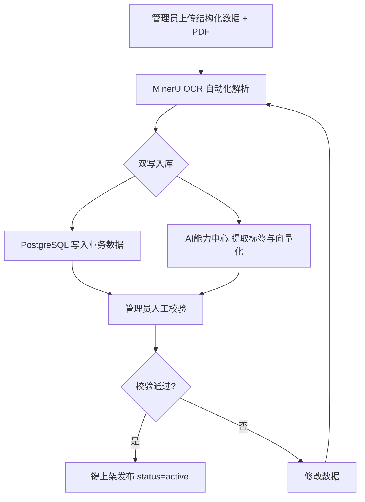
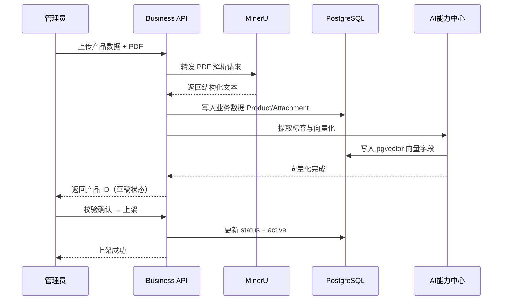
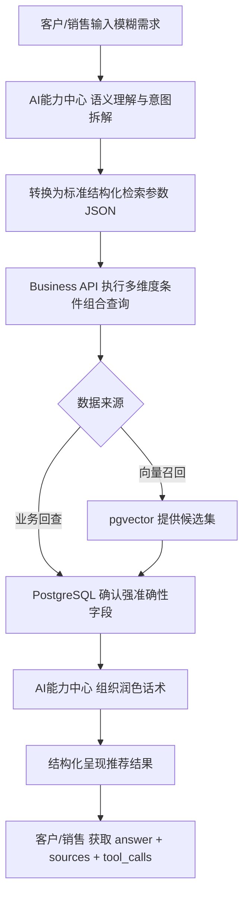
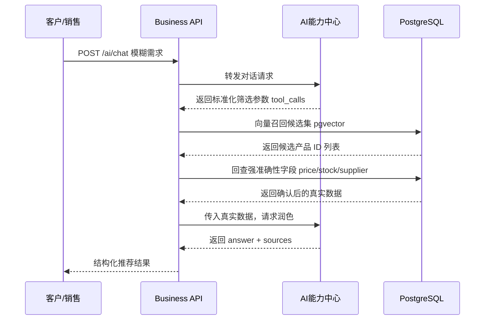
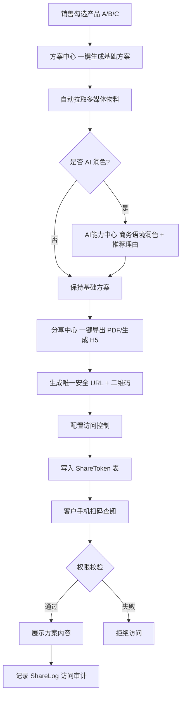
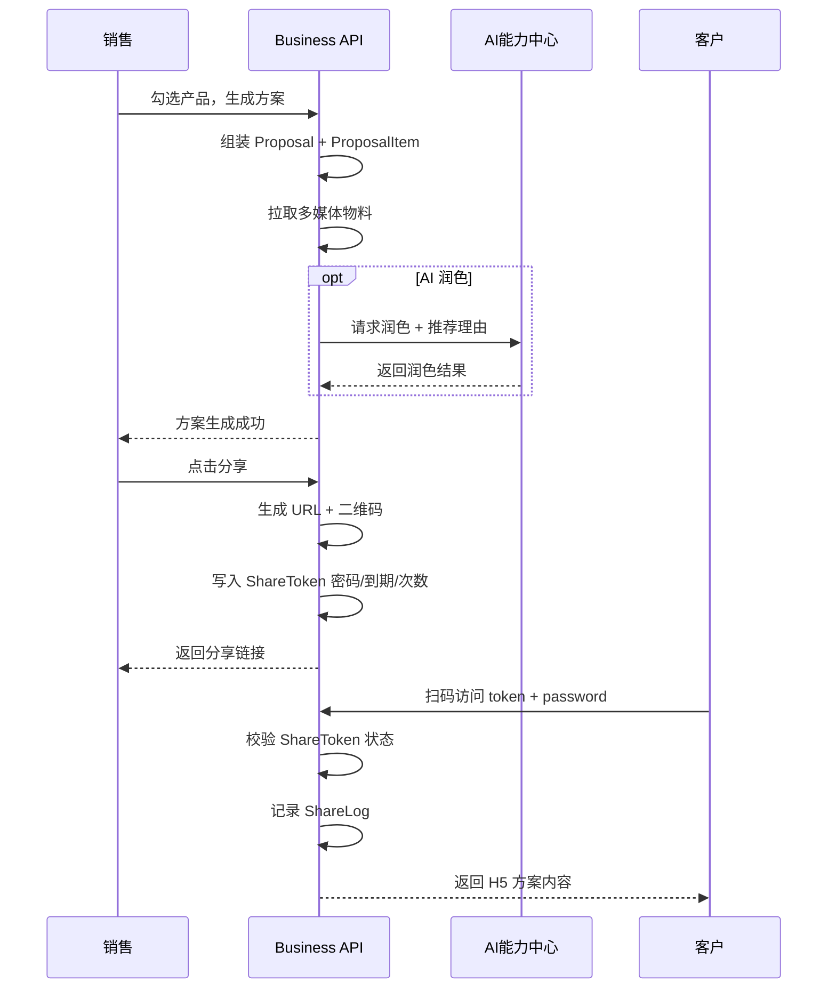
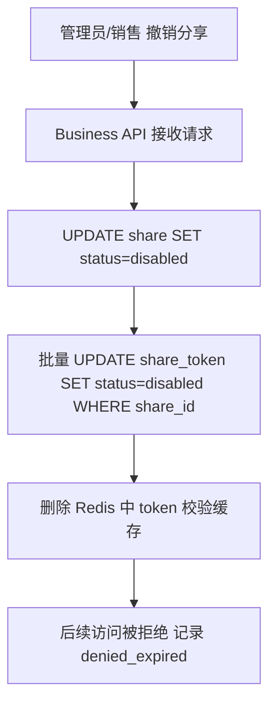
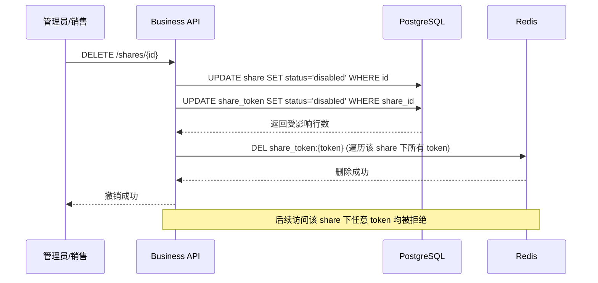
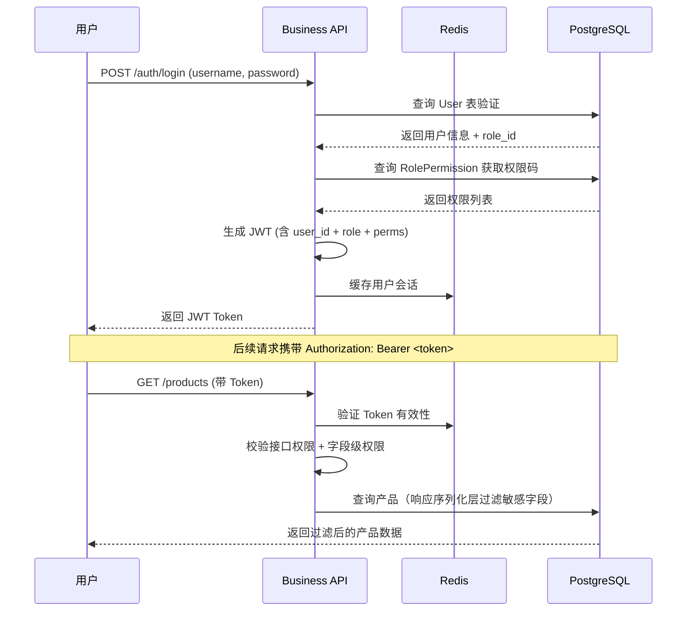
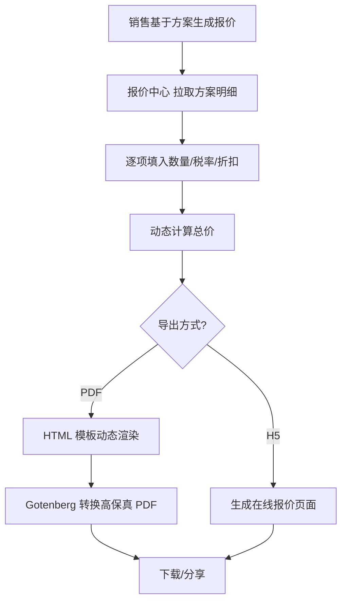

# 05 - 业务流程（BPM）

> 本文档基于概念方案第四章"核心业务流程设计"，使用 Mermaid 绘制时序图与流程图，覆盖产品归档、AI 推荐、方案分享等核心链路。

---

## 一、产品上传与知识归档流程

### 1.1 流程说明

管理员上传产品结构化数据与 PDF 附件，系统通过 MinerU OCR 自动解析，双写入库（业务库 + 向量知识库），人工校验后一键上架。

### 1.2 流程图



### 1.3 时序图



### 1.4 库存状态并发控制说明

产品 `stock_status` 字段在多人并发修改时，采用乐观锁机制：

```sql
UPDATE product
SET stock_status = $1, version = version + 1
WHERE id = $2 AND version = $3;
```

- `product` 表补充 `version INT NOT NULL DEFAULT 0` 字段（由 Agent-A 在 ERD 中添加，此处仅说明流程）
- 并发更新时，若返回受影响行数为 0，说明版本号不匹配，需重试
- 适用场景：采购/产品经理批量调整库存状态

---

## 二、AI 智能产品推荐流程

### 2.1 流程说明

客户/销售输入模糊需求，AI 理解意图后转化为标准化筛选条件，调用 Business API 执行多维度条件组合查询，结果经 AI 润色后结构化呈现。

> ⚠ 红线：向量召回只提供候选集，价格/库存等强准确性字段必须由 Business API 回查关系型数据库确认。

### 2.2 流程图



### 2.3 时序图（含回查闭环）



---

## 三、销售方案生成与对外分享流程

### 3.1 流程说明

销售勾选产品组合，系统自动生成基础方案，AI 执行商务语境润色与推荐理由生成，分享中心一键导出 PDF/生成 H5 与二维码，客户手机扫码查阅。

### 3.2 流程图



### 3.3 时序图



### 3.4 撤销分享与级联失效流程

#### 流程图



#### 时序图



---

## 四、用户登录与鉴权流程



---

## 五、报价单生成流程



---

*本文档随业务流程迭代持续更新。当前阶段：概念完善。*

---

## 修订记录

| 日期 | 修订内容 | 修订人 |
| --- | --- | --- |
| 2026-07-12 | 按总经理审查报告 P0/P1/P2 项修订 | Agent-B |
